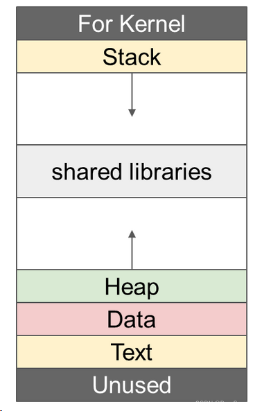
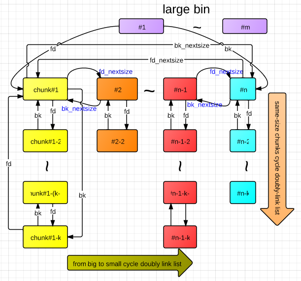
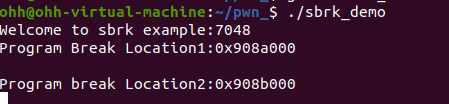
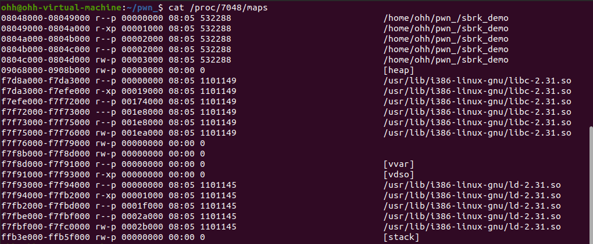
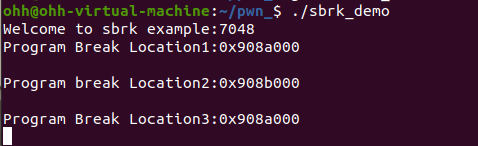
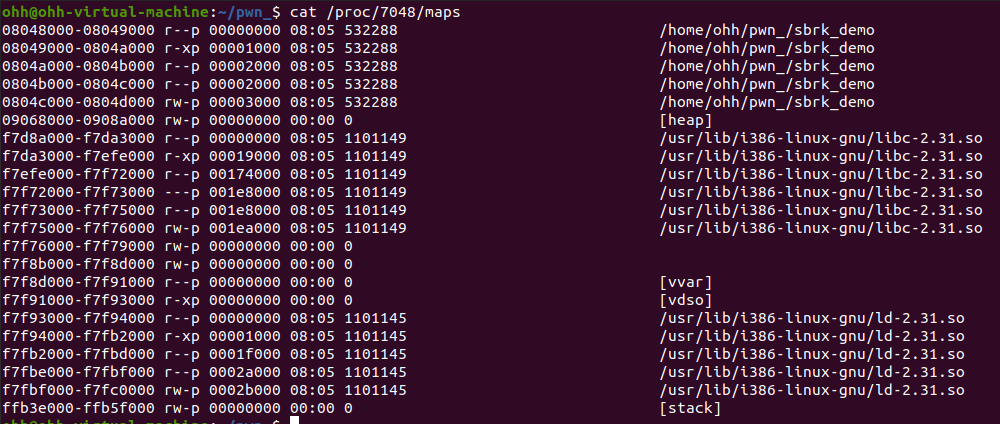

## 概述

> 有些数据的大小在代码编译阶段是无法确定的，比如用户上传照片的尺寸，或者读取的文件大小，就因为他们是未知的，所以我们不能使用大小有限且固定的栈中，而是需要在运行期间按需向操作系统申请一块区域，而这块区域，就叫堆

### 定义

堆就是程序虚拟地址空间的一块连续的线性区域，它由低地址往高地址增长，我们称管理堆的那部分程序为**堆管理器**

堆管理器主要做以下工作：

1.响应用户的申请内存请求，向操作系统申请内存，然后将其返回给程序，同时，为了保持内存管理的高效性，内核一般会预先分配很大的一块连续的内存，然后让堆管理器进行管理，只有当堆空间不足的时候，堆管理器才会再次与操作系统进行交互

2.管理用户所释放的内存，一般来说，程序释放的内存不会直接返回给操作系统，而是由堆管理器进行管理，这些释放的内存可以用来响应用户新申请的内存的请求	

> 这里的堆管理器，也可以称为内存分配器，Linux下默认的堆管理器是glibc（ptmalloc）
>
> 可以这么理解，glibc是Linux下的核心C标准库，包含了文件操作，字符串处理，数学计算等功能，而内存管理(malloc和free的实现)正是glibc的一个核心模块，负责这个模块的组件就是ptmalloc！
>
> 但是glibc的ptmalloc在多线程并发的情况下有时候性能不是很好，所以很多公司自己开发了更强的"堆管理器"来替换它，比如Google的tcmalloc，Facebook的jemalloc，微软的mimalloc

### 分布图



> 由高地址往低地址

#### For Kernel(内核空间)

内存的最高位置，是操作系统内核专用的内存区域

#### Stack(栈区)

高地址往低地址增长，用于存放程序运行时的局部变量，函数参数和函数调用的返回地址

#### Shared libraries(共享库)

在堆与栈之间，用来存放程序运行时加载的动态链接库

#### Heap(堆区)

低地址往高地址增长，用于动态内存分配

`可以看到这里有上下两个箭头，其实也就是栈向下长，堆向上长，使堆栈可以根据程序的需要动态向中间扩展空间，只要没有相交，内存就可以一直分配`

#### Data(数据段)

用来存放程序中的全局变量和静态变量

#### Text(代码段)

存放程序的机器指令，这个区域通常是只读的，防止程序意外修改自己的指令而崩溃

#### Unused(未使用区)

内存的最低地址，这部分内存通常是被保护起来不让访问的

### 基本操作

> 主要有堆的分配，回收，堆分配背后的系统调用，以及堆的多线程支持

堆的操作，其核心靠的就是malloc和free，同时，日常还会用到realloc和calloc

#### malloc

我们可以先看看glibc的[malloc.c](https://github.com/bminor/glibc/blob/master/malloc/malloc.c)源码

```c++
/*
  malloc(size_t n)
  Returns a pointer to a newly allocated chunk of at least n bytes, or null
  if no space is available. Additionally, on failure, errno is
  set to ENOMEM on ANSI C systems.
  If n is zero, malloc returns a minumum-sized chunk. (The minimum
  size is 16 bytes on most 32bit systems, and 24 or 32 bytes on 64bit
  systems.)  On most systems, size_t is an unsigned type, so calls
  with negative arguments are interpreted as requests for huge amounts
  of space, which will often fail. The maximum supported value of n
  differs across systems, but is in all cases less than the maximum
  representable value of a size_t.
*/
```

这一段说明可以提取出malloc函数会返回对应大小字节的内存块指针，同时函数对一些异常情况做了处理：

- 当 n=0 时，返回当前系统允许的堆的最小内存块。
- 当 n 为负数时，由于在大多数系统上，**size_t 是无符号数（这一点非常重要）**，所以程序就会申请很大的内存空间，但通常来说都会失败，因为系统没有那么多的内存可以分配。

##### 源码分析

##### __libc_malloc

> 它是整个内存分配的入口函数，核心功能在于处理多线程竞争，缓存优化，安全检查，最后把工作交给_int_malloc去做

###### 完整源码

```c++
void *
__libc_malloc (size_t bytes)
{
  mstate ar_ptr;
  void *victim;

  /* 1. 检查并执行 Hook (钩子) 函数 */
  void *(*hook) (size_t, const void *)
    = atomic_forced_read (__malloc_hook);
  if (__builtin_expect (hook != NULL, 0))
    return (*hook)(bytes, RETURN_ADDRESS (0));

  /* 2. 获取分配区 (Arena) 并加锁 */
  arena_get (ar_ptr, bytes);

  /* 3. 调用核心分配函数 _int_malloc */
  victim = _int_malloc (ar_ptr, bytes);
  
  /* 4. 容错与重试机制 */
  /* Retry with another arena only if we were able to find a usable arena before.  */
  if (!victim && ar_ptr != NULL)
    {
      LIBC_PROBE (memory_malloc_retry, 1, bytes);
      ar_ptr = arena_get_retry (ar_ptr, bytes);
      victim = _int_malloc (ar_ptr, bytes);
    }

  /* 5. 解锁分配区 */
  if (ar_ptr != NULL)
    (void) mutex_unlock (&ar_ptr->mutex);

  /* 6. 断言检查 */
  assert (!victim || chunk_is_mmapped (mem2chunk (victim)) ||
          ar_ptr == arena_for_chunk (mem2chunk (victim)));
          
  return victim;
}
```

**1.变量定义**

```c++
mstate ar_ptr;  // Arena 指针。多线程下，每个线程需要找一个 Arena(分配区) 来获取内存。
void *victim;   // 最终分配出来的内存块(Chunk)的指针。
```

mstate其实就是struct malloc_state *

**2.Hook**

```C
void *(*hook) (size_t, const void *)
    = atomic_forced_read (__malloc_hook);
  if (__builtin_expect (hook != NULL, 0))
    return (*hook)(bytes, RETURN_ADDRESS (0));
```

通过读取全局变量__malloc_hook，如果它不是NULL，就不往下走了，直接把参数传给Hook函数并执行，正常用途在于可以写一个函数替换他，用来做内存泄漏检测

但我们在漏洞利用中，我们可以想办法把__malloc_hook的地址覆盖成恶意代码（如system("/bin/sh")）的地址，一旦覆盖成功，程序下次调用malloc时，就直接执行系统调用getshell

**3.获取Arena并加锁**

```C
arena_get (ar_ptr, bytes);
```

一个宏定义，会为当前线程寻找一个可用的Arena（没有的话就新建一个或者阻塞等待），找到后将其地址赋给arena_ptr，并对这个Arena加锁，这是为了防止多线程抢同一块内存，arena_get之后，别的线程就暂时不能动这个Arena了

---

**拓展：Arena**

> Arena翻译为分配区，传统意义上，只有一个全局分配区的情况下，多线程并发时，往往会出现竞争极度激烈的情况，所以我们需要多个Arenas来解决这个问题

glibc中，Arena的真实名字叫做struct malloc_state，可以把它当做一个大管家，当操作系统把一大块内存批给程序之后，就是由Arena来负责“划线、建仓库、管理借还”

它包含了：

1. 一把互斥锁(Mutex)：就是为了防止多个线程在同一个Arena里竞争而设置的锁
2. 一堆回收站(Bins)：包含Fastbins，Smallbins，Largebins，Unsorted bin的链表头指针，free掉的内存，都挂在这些属于该Arena的链表上
3. Top Chunk指针：指向当前这块内存的“边缘”，如果回收站里找不到合适的内存，就从Top Chunk这里切一块出去，可以把它理解为未分配的"荒野"

对于Arena分为两类

1. 主分配区（Main Arena）

   全局只有一个，程序刚启动的主线程（Main Thread）默认使用它，当他的内存不够时，可以通过brk移动堆顶指针来扩容，也可以通过mmap映射新内存

2. 非主分配区（Thread Arenas/Non-main Arenas）

   有多个，程序刚创建的子线程使用，当子线程调用malloc，发现Main Arena被锁了，它就会去寻找或创建一个新的Thread Arena，他们不使用brk（因为brk调整的是整个进程唯一的数据段边界），他们只能通过mmap系统调用，向操作系统申请一块独立的，不连续的区域

**Arena 的最大数量 = CPU 核心数 × 8**

---

**4.让_int_malloc干活**

```c++
victim = _int_malloc (ar_ptr, bytes);
```

把加好锁的Arena和用户申请的bytes扔给_int_malloc，对于该函数的源码，后文会分析。。

**5.失败重试机制**

```c++
if (!victim && ar_ptr != NULL)
    {
      LIBC_PROBE (memory_malloc_retry, 1, bytes);
      ar_ptr = arena_get_retry (ar_ptr, bytes);
      victim = _int_malloc (ar_ptr, bytes);
    }
```

如果_int_malloc没找到内存（返回NULL），说明当前这个Arena被榨干了，那就调用arena_get_retry换一个Arena再试一次

**6.解锁和返回**

```c++
if (ar_ptr != NULL)
    (void) mutex_unlock (&ar_ptr->mutex);

  assert (!victim || chunk_is_mmapped (mem2chunk (victim)) ||
          ar_ptr == arena_for_chunk (mem2chunk (victim)));
          
  return victim;
```

mutex_unlock：内存分配完了，把Arena解锁，让给别的线程用

assert：断言检查，确保要么没分配到，要么是一块mmap的内存，要么这块内存确实属于刚刚的Arena。。。

---

**拓展：mmp**

> 全称：Memory Map，内存映射

1. 匿名映射：当调用malloc申请内存时，通常glibc是从自己的仓库（Arena/Bins）里面拿内存的，或者通过移动brk指针来扩大自己的仓库，但是如果突然malloc一块非常大的内存，这时会发生--

   `glibc发现申请的内存大于一个阈值（称为MMAP_THRESHOLD)，他就不会跟正常一样去brk扩展主仓库了，而是直接调用底层的mmap系统调用，mmap会直接在进程内存布局的中间区域（也就是上文那个shared libraries区域附近），强行开辟出一块全新的，干净的，连续的虚拟内存，因为这块内存不和磁盘上的任何文件相关联，所以叫"匿名"映射`

   对这一块大内存调用free时，glibc也不会把它回收进自己的回收站，而是直接调用对应的munmap函数，这块内存就瞬间蒸发，完完全全还给操作系统

   > 可以知道，非主分配区（Thread Arenas）不能用 brk，因为 brk 只能调主堆的顶端，那子线程的 Arena 从哪进货？就是靠 mmap 每次向系统申请 1MB 甚至更大的“匿名内存块”作为自己的初始仓库！

2. 文件映射

   > 通常情况下我们要读写一个文件，传统做法是read()和write()，但是操作系统要先从硬盘中把文件读到内核空间，再从内核空间拷贝到用户空间程序里，不仅慢，而且白白浪费了一次拷贝的时间和内存，接下去看看mmp是咋做的

   mmp可以直接把磁盘上那个文件，"映射"到程序的一块虚拟内存上，从此程序看这块内存，里面就是文件的内容，像操作普通数组一样修改这块内存里的数据，磁盘上的文件就自动被修改了

   **文件映射的核心优势：**

   1. **零拷贝（Zero-Copy）思想：** 省去了内核空间到用户空间的数据拷贝，速度极快。
   2. **大文件处理：** 就算文件有 100GB，你的内存只有 8GB，也可以用 mmap 映射。因为操作系统会有“懒加载（缺页中断）”机制，你访问到哪一段，系统才把硬盘上哪一段真正加载进物理内存。
   3. **进程间通信（IPC）：** 两个不同的程序，如果用 mmap 映射了硬盘上的同一个文件，那么它们就拥有了一块“共享内存”。进程A改了数据，进程B立刻就能看到。

##### _int_malloc

> 由于这个函数过于的长，大概有1000多行qwq，就不贴完整源码了[可跳转查看](https://github.com/iromise/glibc/blob/master/malloc/malloc.c#L3147)

_int_malloc这个函数对于内存的处理可以说是严丝合缝，会按照从小到大，从快到慢的优先级去各个"回收站"里找：

1. Fastbins（极速缓存）：大小在16~128字节，速度最快
2. Small bins（小箱子）：大小在16~512字节，双向链表 
3. Unsorted bin（未分类垃圾堆）：如果你要的内存块在前两个找不到，glibc就会到这里重新整理分类，顺便看看有没有满足的
4. Large bins（大箱子）：大于512字节，按大小排序
5. Top Chunk（荒野区）：前面的"二手"内存块都没了，只能取堆的最高处切一块新的
6. sysmalloc（内核）：Top Chunk也没了，调用brk/mmp向操作系统要物理内存 

###### 分析

```C
static void *_int_malloc(mstate av, size_t bytes) {
    INTERNAL_SIZE_T nb;  /* normalized request size */
    unsigned int    idx; /* associated bin index */
    mbinptr         bin; /* associated bin */

    mchunkptr       victim;       /* inspected/selected chunk */
    INTERNAL_SIZE_T size;         /* its size */
    int             victim_index; /* its bin index */

    mchunkptr     remainder;      /* remainder from a split */
    unsigned long remainder_size; /* its size */

    unsigned int block; /* bit map traverser */
    unsigned int bit;   /* bit map traverser */
    unsigned int map;   /* current word of binmap */

    mchunkptr fwd; /* misc temp for linking */
    mchunkptr bck; /* misc temp for linking */

    const char *errstr = NULL;

    /*
       Convert request size to internal form by adding SIZE_SZ bytes
       overhead plus possibly more to obtain necessary alignment and/or
       to obtain a size of at least MINSIZE, the smallest allocatable
       size. Also, checked_request2size traps (returning 0) request sizes
       that are so large that they wrap around zero when padded and
       aligned.
     */

    checked_request2size(bytes, nb);

    /* There are no usable arenas.  Fall back to sysmalloc to get a chunk from
       mmap.  */
    if (__glibc_unlikely(av == NULL)) {
        void *p = sysmalloc(nb, av);
        if (p != NULL) alloc_perturb(p, bytes);
        return p;
    }
```

变量的初始化，最主要的是把用户请求的bytes转换成最小能满足的chunk size，变量名为nb，注意，64为系统所有的chunk必须是16字节对齐的，也就是说，malloc申请的内存在底层需要的nb都是32字节（16字节用户数据+16字节Chunk Header）

```c++
__glibc_unlikely(exp)表示exp很可能为假。
__glibc_likely(exp)表示exp很可能为真。
__builtin_expect(exp,value)表示exp==value大概率成立
```

注意这几个宏定义，他们不会改变程序逻辑，只是告诉编译器这个很可能为某个值，就把否的情况作为跳转，真的情况就顺序运行下去，减少程序的跳转，一定程度上可以优化程序运行速度

举个例子，看这一段

```C
static int perturb_byte;
static void alloc_perturb (char *p, size_t n)
{
  if (__glibc_unlikely (perturb_byte))
    memset (p, perturb_byte ^ 0xff, n);
}
```

逻辑在于分配的时候arena为空，那就调用sys_malloc系统调用去请求一个chunk，然后memset这个chunk的数据段，通常情况下perturb_byte为假，意思就是只要没有特意去改，那么data段全为0字节，实际情况也是如此

**fast bin分配**

```C
/*Fastbin 极速分配逻辑*/
  /* 如果请求的真实大小nb小于等于fastbin的最大限制 (通常是128字节) */
  if ((unsigned long) (nb) <= (unsigned long) (get_max_fast ()))
    {
      /* 算出这个大小对应 Fastbin 数组的哪一个槽位 (idx) */
      idx = fastbin_index (nb);
      /* 获取这个槽位的头指针 */
      mfastbinptr *fb = &fastbin (av, idx);
      mchunkptr pp = *fb;
      
      /* 利用原子操作(CAS)把链表头的第一个 Chunk 摘下来，赋给 victim */
      do
        {
          victim = pp;
          if (victim == NULL)
            break; // 如果这个槽位是空的，跳出循环，去别的地方找
        }
      while ((pp = catomic_compare_and_exchange_val_acq (fb, victim->fd, victim))
             != victim);

      /* 如果成功从 fastbin 摘下了一块内存 (victim 不为空) */
      if (victim != 0)
        {
          //核心安全检查：检查摘下来的 Chunk 大小，是否真的属于这个槽位！//
          if (__builtin_expect (fastbin_index (chunksize (victim)) != idx, 0))
            {
              errstr = "malloc(): memory corruption (fast)";
            errout:
              malloc_printerr (check_action, errstr, chunk2mem (victim), av);
              return NULL;
            }
            
          /* 检查通过，把这块内存的“数据区”指针转换出来 (chunk2mem) */
          check_remalloced_chunk (av, victim, nb);
          void *p = chunk2mem (victim);
          
          /* 如果开启了调试/扰乱功能，把这块内存填充些垃圾数据，防止读到老数据 */
          alloc_perturb (p, bytes);
          
          /* 成功返回给用户！流程结束！ */
          return p;
        }
    }
```

逻辑就是看看申请的nb是否<=global_max_fast，如果成立就先在fast bin中寻找能满足的chunk，并且一定是完全匹配

fastbins其实是一个包含多个单向链表的数组，它是LIFO(后进先出)，也就是说刚被free调的小内存，如果马上malloc申请同样的大小，拿到的就是刚刚那块

**重点（中间的check）**

```c
if (__builtin_expect (fastbin_index (chunksize (victim)) != idx, 0))
```

glibc的防御机制在于这行代码，如果我们在Fastbin Attack（比如伪造一个假Chunk把系统权限劫持）中，我们要欺骗malloc，让他把一块假的内存地址返回给我们，那么这行代码就起作用了，他会读取我们伪造的假Chunk的size位，算一下索引，看看和当前的idx是不是一样 

知道这个就可以绕过了，可以在目标内存附近（比如__malloc_hook）寻找一下有没有什么数据，正好可以错位当做size位，只要它满足这个大小检查，假Chunk就成功分配出来了

末尾还有一个check：

```C
static void
do_check_remalloced_chunk (mstate av, mchunkptr p, INTERNAL_SIZE_T s)
{
  INTERNAL_SIZE_T sz = p->size & ~(PREV_INUSE | NON_MAIN_ARENA);

  if (!chunk_is_mmapped (p))
    {
      assert (av == arena_for_chunk (p));
      if (chunk_non_main_arena (p))
        assert (av != &main_arena);
      else
        assert (av == &main_arena);
    }

  do_check_inuse_chunk (av, p);

  /* Legal size ... */
  assert ((sz & MALLOC_ALIGN_MASK) == 0);
  assert ((unsigned long) (sz) >= MINSIZE);
  /* ... and alignment */
  assert (aligned_OK (chunk2mem (p)));
  /* chunk is less than MINSIZE more than request */
  assert ((long) (sz) - (long) (s) >= 0);
  assert ((long) (sz) - (long) (s + MINSIZE) < 0);
}
```

可以知道这个check就是check各个标志位，一般不会被触发

相当于fast bin分配时一般只会有一个check，就是看看那个chunk的size是否等于我申请的size，过了的话就直接把这个chunk指针返回，没过就报错。。。

---

**small bin分配**

```C
#define NBINS             128
#define NSMALLBINS         64
#define SMALLBIN_WIDTH    MALLOC_ALIGNMENT
#define SMALLBIN_CORRECTION (MALLOC_ALIGNMENT > 2 * SIZE_SZ)
#define MIN_LARGE_SIZE    ((NSMALLBINS - SMALLBIN_CORRECTION) * SMALLBIN_WIDTH)

#define in_smallbin_range(sz)  \
  ((unsigned long) (sz) < (unsigned long) MIN_LARGE_SIZE)

#define smallbin_index(sz) \
  ((SMALLBIN_WIDTH == 16 ? (((unsigned) (sz)) >> 4) : (((unsigned) (sz)) >> 3))\
   + SMALLBIN_CORRECTION)
#define bin_at(m, i) \
  (mbinptr) (((char *) &((m)->bins[((i) - 1) * 2]))                              \
             - offsetof (struct malloc_chunk, fd))
#define first(b)     ((b)->fd)
#define last(b)      ((b)->bk)

        /*
     If a small request, check regular bin.  Since these "smallbins"
     hold one size each, no searching within bins is necessary.
     (For a large request, we need to wait until unsorted chunks are
     processed to find best fit. But for small ones, fits are exact
     anyway, so we can check now, which is faster.)
   */
/* 

   * Small bin 分配逻辑
   * 判断标准化后的大小 nb 是否在 Small bin 的范围内 
   */
  if (in_smallbin_range (nb))
    {
      /* 计算对应的 Small bin 索引 idx */
      idx = smallbin_index (nb);
      /* 获取对应双向链表的头指针 bin */
      bin = bin_at (av, idx);

      /* 
       * victim = last(bin) 意思是取链表的**尾部**元素 (FIFO 先进先出) 
       * 如果 victim != bin，说明这个 bin 链表不是空的，里面有空闲内存！
       */
      if ((victim = last (bin)) != bin)
        {
          /* 
           * 极端特殊情况：如果取出来的 victim 是 0，说明整个 Arena 还没初始化好。
           * 这时调用 malloc_consolidate 强行初始化。
           */
          if (victim == 0) /* initialization check */
            malloc_consolidate (av);
          else
            {
              /* 获取倒数第二个元素 bck */
              bck = victim->bk;
              
              /* 核心安全检查：双向链表完整性校验 (Safe Unlinking 雏形) */
              if (__glibc_unlikely (bck->fd != victim))
                {
                  errstr = "malloc(): smallbin double linked list corrupted";
                  goto errout;
                }
              
              /* 检查通过，把 victim 设置为使用状态 (修改下一个 chunk 的 P 位) */
              set_inuse_bit_at_offset (victim, nb);
              
              /* 把 victim 从双向链表里“摘”下来 */
              bin->bk = bck;
              bck->fd = bin;

              /* 检查是不是由 mmap 直接分配的 (非 Arena 管理)，如果是，做一些容错 */
              if (av != &main_arena)
                set_non_main_arena (victim);
                
              /* 把摘下来的内存转换为用户指针，返回！ */
              check_malloced_chunk (av, victim, nb);
              void *p = chunk2mem (victim);
              alloc_perturb (p, bytes);
              return p;
            }
        }
    }
```

前面的fastbin是单向链表，采用LIFO（后进先出），从链表头取内存，这里的smallbin是双向循环链表，采用FIFO（先进先出），victim = last(bin)，从链表**尾**取内存。

双向链表完整性校验：

```C
if (__glibc_unlikely (bck->fd != victim))
```

这里使用了malloc_consolidate来初始化这个arena分配器

```C
static void malloc_consolidate(mstate av)
{
  mfastbinptr*    fb;                 /* current fastbin being consolidated */
  mfastbinptr*    maxfb;              /* last fastbin (for loop control) */
  mchunkptr       p;                  /* current chunk being consolidated */
  mchunkptr       nextp;              /* next chunk to consolidate */
  mchunkptr       unsorted_bin;       /* bin header */
  mchunkptr       first_unsorted;     /* chunk to link to */

  /* These have same use as in free() */
  mchunkptr       nextchunk;
  INTERNAL_SIZE_T size;
  INTERNAL_SIZE_T nextsize;
  INTERNAL_SIZE_T prevsize;
  int             nextinuse;
  mchunkptr       bck;
  mchunkptr       fwd;

  /*
    If max_fast is 0, we know that av hasn't
    yet been initialized, in which case do so below
  */

  if (get_max_fast () != 0) {
    clear_fastchunks(av);

    unsorted_bin = unsorted_chunks(av);

    /*
      Remove each chunk from fast bin and consolidate it, placing it
      then in unsorted bin. Among other reasons for doing this,
      placing in unsorted bin avoids needing to calculate actual bins
      until malloc is sure that chunks aren't immediately going to be
      reused anyway.
    */mlined version of consolidation code in free() *

    maxfb = &fastbin (av, NFASTBINS - 1);
    fb = &fastbin (av, 0);
    do {
      p = atomic_exchange_acq (fb, 0);
      if (p != 0) {
        do {
          check_inuse_chunk(av, p);
          nextp = p->fd;

          /* Slightly streamlined version of consolidation code in free() */
          size = p->size & ~(PREV_INUSE|NON_MAIN_ARENA);
          nextchunk = chunk_at_offset(p, size);
          nextsize = chunksize(nextchunk);

          if (!prev_inuse(p)) {
            prevsize = p->prev_size;
            size += prevsize;
            p = chunk_at_offset(p, -((long) prevsize));
            unlink(av, p, bck, fwd);
          }

          if (nextchunk != av->top) {
            nextinuse = inuse_bit_at_offset(nextchunk, nextsize);

            if (!nextinuse) {
              size += nextsize;
              unlink(av, nextchunk, bck, fwd);
            } else
              clear_inuse_bit_at_offset(nextchunk, 0);

            first_unsorted = unsorted_bin->fd;
            unsorted_bin->fd = p;
            first_unsorted->bk = p;

            if (!in_smallbin_range (size)) {
              p->fd_nextsize = NULL;
              p->bk_nextsize = NULL;
            }

            set_head(p, size | PREV_INUSE);
            p->bk = unsorted_bin;
            p->fd = first_unsorted;
            set_foot(p, size);
          }

          else {
            size += nextsize;
            set_head(p, size | PREV_INUSE);
            av->top = p;
          }

        } while ( (p = nextp) != 0);

      }
    } while (fb++ != maxfb);
  }
  else {
    malloc_init_state(av);
    check_malloc_state(av);
  }
}
```

大致意思就是清空所有arena的chunks，可以看到大的if是判断global_max_fast是否为0，为0则初始化，调用malloc_init_state和check_malloc_state函数初始化堆，否则把所有的fast bin取出来，先清除它们的标志位，然后扔到unsorted bin中尝试向前合并或者向后合并。

---

**large bin分配**

```
/* 
   * Large bin 的前置处理 (如果是大内存请求)
   */
  else
    {
      /* 计算 Large bin 的索引 */
      idx = largebin_index (nb);
      
      /* 
       * 堆碎片的克星：malloc_consolidate
       * 如果 Fastbins 里有空闲的碎内存 (have_fastchunks)，
       * 就不管三七二十一，先调用 malloc_consolidate 触发“合并机制”。
       */
      if (have_fastchunks (av))
        malloc_consolidate (av);
    }
```

- **为什么需要 malloc_consolidate？**
  Fastbin 虽然快，但它有一个致命弱点：**它里面的内存即使物理相邻，也不会合并**（为了追求速度）。如果你一直 malloc/free 小内存，堆里会全是 32 字节、64 字节的碎片。此时你突然要一个 1024 字节的大内存，哪怕堆的总空间够，也会因为没有“连续”的空间而分配失败。
  所以，在向 Large bins 借大块内存前，管家会强制把 Fastbins 里的碎片全部倒出来，跟相邻的空闲内存合并成大块，扔进 Unsorted bin 里。

就是因为对于malloc_consolidate这个函数，如果没有初始化，那么初始化，如果初始化了，那么合并所有的fast bin。但是这里，都已经有fast bin存在了，那么堆指定已经初始化了，所以这里执行的逻辑基本只能是合并所有fast chunk，合并的目的在于空间上优化

例如：如果一个0x15的fastbin和0x200的largebin物理相邻，我需要申请一个0x210的内存，如果此时他俩合并了，那我们就可以找到一个0x215的内存块给用户，如果不做这一步，就无法找到。

---

**Unsorted bin分配**

```C
for (;;) {
        int iters = 0;
        // walk from the unsorted head to end to find one chunk
        // First In First Out
        while ((victim = unsorted_chunks(av)->bk) != unsorted_chunks(av)) {
            bck = victim->bk;
            if (__builtin_expect(chunksize_nomask(victim) <= 2 * SIZE_SZ, 0) ||
                __builtin_expect(chunksize_nomask(victim) > av->system_mem, 0))
                malloc_printerr(check_action, "malloc(): memory corruption",
                                chunk2mem(victim), av);
            size = chunksize(victim);

            /*
               If a small request, try to use last remainder if it is the
               only chunk in unsorted bin.  This helps promote locality for
               runs of consecutive small requests. This is the only
               exception to best-fit, and applies only when there is
               no exact fit for a small chunk.
             */

            if (in_smallbin_range(nb) && bck == unsorted_chunks(av) &&
                victim == av->last_remainder &&
                (unsigned long) (size) > (unsigned long) (nb + MINSIZE)) {
                /* split and reattach remainder */
                remainder_size          = size - nb;
                remainder               = chunk_at_offset(victim, nb);
                unsorted_chunks(av)->bk = unsorted_chunks(av)->fd = remainder;
                av->last_remainder                                = remainder;
                remainder->bk = remainder->fd = unsorted_chunks(av);
                if (!in_smallbin_range(remainder_size)) {
                    remainder->fd_nextsize = NULL;
                    remainder->bk_nextsize = NULL;
                }

                set_head(victim, nb | PREV_INUSE |
                                     (av != &main_arena ? NON_MAIN_ARENA : 0));
                set_head(remainder, remainder_size | PREV_INUSE);
                set_foot(remainder, remainder_size);

                check_malloced_chunk(av, victim, nb);
                void *p = chunk2mem(victim);
                alloc_perturb(p, bytes);
                return p;
            }
```

这一块逻辑就是在遍历开始时，检查victim->size，若size小于最小值（2*SIZE_SZ）或大于进程可分配系统内存上限（av->system_mem），触发memory corruption异常

对于Last Remainder匹配，若当前请求属于small bin范围，且unsorted bin中仅存唯一一个chunk，且该chunk正好是上次切割遗留的last_remainder，于是直接从该last_remainder中进行切割，分离出请求大小的chunk返回，将剩余部分更新为last_remainder

```C
unsorted_chunks (av)->bk = bck;
bck->fd = unsorted_chunks (av);

/* Take now instead of binning if exact fit */

if (size == nb)
{
    set_inuse_bit_at_offset (victim, size);
    if (av != &main_arena)
            victim->size |= NON_MAIN_ARENA;
    check_malloced_chunk (av, victim, nb);
    void *p = chunk2mem (victim);
    alloc_perturb (p, bytes);
    return p;
}

/* place chunk in bin */

if (in_smallbin_range (size))
{
    victim_index = smallbin_index (size);
    bck = bin_at (av, victim_index);
    fwd = bck->fd;
}
```

若遍历到的chunk size严格等于请求的标准化大小nb，则直接将其从Unsorted bin物理脱链(Unlink）设置INUSE标志位并返回给用户

若大小不匹配则将其从Unsorted bin中移除，并根据size插入到相应的small bin或large bin

```C
else
{
    victim_index = largebin_index (size);
    bck = bin_at (av, victim_index);
    fwd = bck->fd;

    /* maintain large bins in sorted order */
    if (fwd != bck)
    {
        /* Or with inuse bit to speed comparisons */
        size |= PREV_INUSE;
        /* if smaller than smallest, bypass loop below */
        assert ((bck->bk->size & NON_MAIN_ARENA) == 0);
        if ((unsigned long) (size) < (unsigned long) (bck->bk->size))
        {
            fwd = bck;
            bck = bck->bk;

            victim->fd_nextsize = fwd->fd;
            victim->bk_nextsize = fwd->fd->bk_nextsize;
            fwd->fd->bk_nextsize = victim->bk_nextsize->fd_nextsize = victim;
        }
        else
        {
            assert ((fwd->size & NON_MAIN_ARENA) == 0);
            while ((unsigned long) size < fwd->size)
            {
                fwd = fwd->fd_nextsize;
                assert ((fwd->size & NON_MAIN_ARENA) == 0);
            }

            if ((unsigned long) size == (unsigned long) fwd->size)
                /* Always insert in the second position.  */
                fwd = fwd->fd;
            else
            {
                victim->fd_nextsize = fwd;
                victim->bk_nextsize = fwd->bk_nextsize;
                fwd->bk_nextsize = victim;
                victim->bk_nextsize->fd_nextsize = victim;
            }
            bck = fwd->bk;
        }
    }
    else
            victim->fd_nextsize = victim->bk_nextsize = victim;
}
mark_bin (av, victim_index);
victim->bk = bck;
victim->fd = fwd;
fwd->bk = victim;
bck->fd = victim;
#define MAX_ITERS       10000
if (++iters >= MAX_ITERS)
    break;
```

Large bin插入特性：Large bin内部维护的是基于大小递减的二维双向链表，插入时需遍历fd_nextsize/bk_nextsize跳表指针，找到位置进行插入

这里要知道，`large bin`可是所有`bin`当中最复杂的`bin`了，一个`chunk`四个指针，一对`bin`管理一个二维双向链表，`fd`,`bk`指针与相同大小的`chunk`连接，`fd_nextsize`和`bk_nextsize`与不同大小的`chunk`连接，有一幅图可以看看



> bck指的是bin所在chunk，fwd指的是最大的chunk

最后，为防止遍历过长的 Unsorted bin 导致分配延迟过高，引入 MAX_ITERS（硬编码为10000）。达到上限则强制中断遍历，进入下一阶段

到了这里，unsorted bin的遍历就结束了

```C
if (!in_smallbin_range (nb))
{
    bin = bin_at (av, idx);

    /* skip scan if empty or largest chunk is too small */
    if ((victim = first (bin)) != bin &&
        (unsigned long) (victim->size) >= (unsigned long) (nb))
    {
        victim = victim->bk_nextsize;
        while (((unsigned long) (size = chunksize (victim)) <
                (unsigned long) (nb)))
            victim = victim->bk_nextsize;

        /* Avoid removing the first entry for a size so that the skip
                 list does not have to be rerouted.  */
        if (victim != last (bin) && victim->size == victim->fd->size)
            victim = victim->fd;

        remainder_size = size - nb;
        unlink (av, victim, bck, fwd);

        /* Exhaust */
        if (remainder_size < MINSIZE)
        {
            set_inuse_bit_at_offset (victim, size);
            if (av != &main_arena)
                victim->size |= NON_MAIN_ARENA;
        }
        /* Split */
        else
        {
            remainder = chunk_at_offset (victim, nb);
            /* We cannot assume the unsorted list is empty and therefore
                     have to perform a complete insert here.  */
            bck = unsorted_chunks (av);
            fwd = bck->fd;
            if (__glibc_unlikely (fwd->bk != bck))
            {
                errstr = "malloc(): cor
                    rupted unsorted chunks";
                goto errout;
            }
            remainder->bk = bck;
            remainder->fd = fwd;
            bck->fd = remainder;
            fwd->bk = remainder;
            if (!in_smallbin_range (remainder_size))
            {
                remainder->fd_nextsize = NULL;
                remainder->bk_nextsize = NULL;
            }
            set_head (victim, nb | PREV_INUSE |
                      (av != &main_arena ? NON_MAIN_ARENA : 0));
            set_head (remainder, remainder_size | PREV_INUSE);
            set_foot (remainder, remainder_size);
        }
        check_malloced_chunk (av, victim, nb);
        void *p = chunk2mem (victim);
        alloc_perturb (p, bytes);
        return p;
    }
}
```

当unsorted bin遍历完毕未找到精准匹配时，若请求为大内存。控制流转入Large bin的分配逻辑

1. **最佳适配搜索 (Best-Fit Search)** 
   - 定位到目标大小对应的 Large bin 索引（Index）。
   - 利用 bk_nextsize 指针（指向由小到大的独立 size 节点），从后向前反向遍历，寻找**首个大小大于或等于请求大小 nb 的 chunk**，以最大程度减少内存碎片。
2. **解链与切割 (Unlink & Split)** 
   - 找到目标 chunk 后，调用 unlink 宏将其从双向链表中安全卸载。
   - **耗尽 (Exhaust)**：若切割后剩余空间（remainder_size）小于最小堆块限制（MINSIZE），则不进行切割，把它物理相邻的下一块prev_inuse位设为1，将整块内存分配给用户。
   - **切割 (Split)**：若剩余空间充足，则将其分裂。前半部分返回给用户；**剩余的 remainder chunk 将被重新链入 Unsorted bin 的头部**，等待后续分配或整理。专属于 Large bin 的跳表指针将被清空，如果被切割的剩下chunk不在small bin范围内，就会清空它的fd_nextsize和bk_nextsize，因为他要回到unsorted bin里面，这两个字段没用

```C
++idx;
bin = bin_at(av, idx);
block = idx2block(idx);
map = av->binmap[block];
bit = idx2bit(idx);

for (;;) {
    /* Skip rest of block if there are no more set bits in this block. */
    if (bit > map || bit == 0) {
        do {
            if (++block >= BINMAPSIZE) /* out of bins */
                goto use_top;
        } while ((map = av->binmap[block]) == 0);

        bin = bin_at(av, (block << BINMAPSHIFT));
        bit = 1;
    }

    /* Advance to bin with set bit. There must be one. */
    while ((bit & map) == 0) {
        bin = next_bin(bin);
        bit <<= 1;
        assert(bit != 0);
    }

    /* Inspect the bin. It is likely to be non-empty */
    victim = last(bin);

    /* If a false alarm (empty bin), clear the bit. */
    if (victim == bin) {
        av->binmap[block] = map &= ~bit; /* Write through */
        bin = next_bin(bin);
        bit <<= 1;
    }
}
```

若对应的Large bin为空，或其最大的chunk仍无法满足nb，分配器不会盲目线性遍历后续数百个bins，而是使用Binmap机制进行O(1)的跳跃式搜索

glibc使用一个位图矩阵（av->binmap）来标识各个bin的空闲状态，获取当前block和对应的map及bit掩码。会进行按位扫描查找，当前block对应掩码为0，则代表空，直接循环查找下一个非空的block。如果所有block都为空，直接跳转，利用位运算（bit&map）快速定位到当前索引之后、首个标志位为1且包含更大size内存块的具体 bin。

我们来看看两个条件

1. `bit>map`：如果这个位的权值都比它整个的`map`都大了，说明`map`上那个`bit`的权值必定为0
2. `bit==0`：如果这个`bit`都是0说明这个`index`也不对。

满足其一就看看别的index，然后如果说map==0，说明这整个block都没有空闲块，就直接跳过，不为0则退出去执行下面的操作，如果超过了block的总数，那就说明unsorted bin和large bin中也没有合适的chunk，那我们就切割top_chunk了，用了一个goto去跳转

```C
else
{
    size = chunksize (victim);

    /*  We know the first chunk in this bin is big enough to use. */
    assert ((unsigned long) (size) >= (unsigned long) (nb));

    remainder_size = size - nb;

    /* unlink */
    unlink (av, victim, bck, fwd);

    /* Exhaust */
    if (remainder_size < MINSIZE)
    {
        set_inuse_bit_at_offset (victim, size);
        if (av != &main_arena)
        victim->size |= NON_MAIN_ARENA;
    }

    /* Split */
    else
    {
        remainder = chunk_at_offset (victim, nb);

        /* We cannot assume the unsorted list is empty and therefore
        have to perform a complete insert here.  */
        bck = unsorted_chunks (av);
        fwd = bck->fd;
        if (__glibc_unlikely (fwd->bk != bck))
        {
            errstr = "malloc(): corrupted unsorted chunks 2";
            goto errout;
        }
        remainder->bk = bck;
        remainder->fd = fwd;
        bck->fd = remainder;
        fwd->bk = remainder;

        /* advertise as last remainder */
        if (in_smallbin_range (nb))
        av->last_remainder = remainder;
        if (!in_smallbin_range (remainder_size))
        {
            remainder->fd_nextsize = NULL;
            remainder->bk_nextsize = NULL;
        }
        set_head (victim, nb | PREV_INUSE |
        (av != &main_arena ? NON_MAIN_ARENA : 0));
        set_head (remainder, remainder_size | PREV_INUSE);
        set_foot (remainder, remainder_size);
    }
    check_malloced_chunk (av, victim, nb);
    void *p = chunk2mem (victim);
    alloc_perturb (p, bytes);
    return p;
}
```

定位到非空的更大bin后，直接提取该 bin 中最末尾的chunk（满足条件的最小块），执行前述相同的**切割与remainder投递到Unsorted bin**的逻辑并返回。

至此整unsorted bin和large bin的分配就结束了。。。

至于切割top chunk部分

```C
use_top:
    /*
             If large enough, split off the chunk bordering the end of memory
             (held in av->top). Note that this is in accord with the best-fit
             search rule.  In effect, av->top is treated as larger (and thus
             less well fitting) than any other available chunk since it can
             be extended to be as large as necessary (up to system
             limitations).

             We require that av->top always exists (i.e., has size >=
             MINSIZE) after initialization, so if it would otherwise be
             exhausted by current request, it is replenished. (The main
             reason for ensuring it exists is that we may need MINSIZE space
             to put in fenceposts in sysmalloc.)
           */

    victim = av->top;
    size = chunksize (victim);

    if ((unsigned long) (size) >= (unsigned long) (nb + MINSIZE))
    {
        remainder_size = size - nb;
        remainder = chunk_at_offset (victim, nb);
        av->top = remainder;
        set_head (victim, nb | PREV_INUSE |
                  (av != &main_arena ? NON_MAIN_ARENA : 0));
        set_head (remainder, remainder_size | PREV_INUSE);

        check_malloced_chunk (av, victim, nb);
        void *p = chunk2mem (victim);
        alloc_perturb (p, bytes);
        return p;
    }

    /* When we are using atomic ops to free fast chunks we can get
             here for all block sizes.  */
    else if (have_fastchunks (av))
    {

        else if (have_fastchunks (av))
        {
            malloc_consolidate (av);
            /* restore original bin index */
            if (in_smallbin_range (nb))
                idx = smallbin_index (nb);
            else
                idx = largebin_index (nb);
        }

        /*Otherwise, relay to handle system-dependent cases*/
        
        else
        {
            void *p = sysmalloc (nb, av);
            if (p != NULL)
                alloc_perturb (p, bytes);
            return p;
        }
    }
}
```

分配器向堆的最高地址边界——荒野区（Top Chunk / av->top）索要内存，若Top Chunk的剩余大小充足（size>=nb+MINSIZE），则直接对其进行切割。顶部推进，底部返回给用户，若top chunk空间告急，分配器会检查fastbin里是否存在碎片（have_fastchunks(av)），若存在，立即调用 malloc_consolidate(av) 强制清空 Fastbin，合并相邻的空闲 chunk，并放入 Unsorted bin。随后，程序逻辑会重新计算索引，**重试整个分配循环**。这也就是为啥要for(;;)死循环的原因

若top chunk耗尽且fastbin也无可提供合适的碎片或者合并后仍然不够，那就只能调用底层sysmalloc(nb,av)了，通过发出brk()或mmp()系统调用，请求Linux内核映射物理内存以扩展进程的虚拟地址空间

#### malloc内存分配总结

整个malloc的分配流是一个**“从局部到全局、从缓存到系统”**的降级搜索过程。核心步骤如下：

1. **入口检查与分配区锁定** 
   进入分配逻辑前，首先检查全局劫持指针 `__malloc_hook`。若无劫持，则为当前线程获取一个可用的分配区 (Arena) 并加锁。若分配区未初始化，直接交由 `sysmalloc` 向内核申请。

2. **Fast bin极速通道 (O(1), LIFO)** 
   若申请大小在 Fast bin 范围内（通常<=128B），直接通过掩码计算索引，去对应的单向链表头部摘取 chunk。若存在且大小校验通过，直接返回。

3. **Small bin精确匹配 (FIFO) 与 大内存预处理** 
   若申请大小在 Small bin 范围内，去对应的双向链表尾部摘取精确大小的chunk。
   *关键分支*：如果申请的是大内存（Large bin级别），此时会触发 `malloc_consolidate`，强制合并 Fast bin 中的所有碎片并放入Unsorted bin，为后续凑大内存做准备。

4. **Unsorted bin大清洗与分拣 (进入核心for循环)** 
   遍历 Unsorted bin (未分类垃圾堆)，对每个chunk执行以下判定：
   * **Last Remainder切割**：若申请小内存，且当前 chunk 是上次切剩的唯一块，直接切割返回。
   * **精确定位**：若chunk大小完美等于申请大小，直接拿走返回。
   * **分类归位**：若不匹配，则按大小将其按序插入到它该去的Small bin或Large bin中（单次最大分拣数限10000，防止卡死）。

5. **Large bin 最佳适配搜索 (Best-Fit)** 
   若前面的精确匹配全部落空，且申请的是大内存，分配器会在对应的 Large bin 内部遍历跳表指针（fd_nextsize` / `bk_nextsize），寻找**大于等于申请大小的最贴合 chunk**。将其切分，所需部分返回，切剩的Remainder退回Unsorted bin。

6. **Binmap 掩码雷达跳跃搜索** 
   若对应的Large bin为空，分配器利用 av->binmap（位图机制）进行O(1)复杂度的按位扫描，直接跳跃寻找到存在更大chunk的空闲bin。找到后进行同样的操作：取出、切割、剩余退回Unsorted bin。

7. **Top Chunk 切割** 
   当所有缓存Bins宣告枯竭，分配器将目光转向堆顶的未分配荒野区 `Top Chunk`。若空间充足，从顶部向下切割所需内存，重置Top指针并返回。

8. **重试 (Consolidate & Retry)** 
   若 `Top Chunk` 空间告急不足以切割，检查Fast bin中是否还有未合并的碎片。若有，调用 `malloc_consolidate` 缝合碎片，并通过外层的 `for(;;)` 机制跳回第 4 步重新开始搜索。

9. **系统级回退 (Sysmalloc 向内核求救)** 
   当用户态的所有机制（Bins+Top Chunk+碎片合并）彻底榨干，最终调用 `sysmalloc`，通过 `brk` 扩展堆顶边界，或通过 `mmap` 在共享映射区独立开辟空间，向操作系统申请物理内存。

10. **安全校验与交付** 
    无论通过何种途径拿到内存，解锁当前Arena，并经过最终的 `Assert` 完整性断言（如校验mmap标志位、校验Arena归属权），确认内存未被越界破坏后，交还给用户空间。

---

#### 误区盲点汇总

##### 1

**什么是碎片合并？（malloc_consolidate）**

首先我们得先知道为啥要合并，因为fastbin追求极致的速度，当你free调一小块内存时，为了省事，glibc会直接把它扔进fastbin，并且不去管他旁边的内存是不是空闲，这会导致：如果连续释放多个小块，他们在物理内存上是连在一起的，本可以拼成一个大块，但因为他们在fastbin里，系统只当他们是碎片，申请大内存则会失败，这就是外部碎片化

随后，我们就可以来看看malloc_consolidate是咋工作的了，当遇到以下情况会触发

- **要申请大内存（Large bin大小）**：glibc在分配大内存前，会强制先大扫除一次。
- **Top chunk都不够用了**：glibc穷途末路，只能大扫除。

大扫除的过程：他会遍历fastbin里的所有小碎片，把他们拿出来，如果发现某一个碎片物理相邻的前一块或者后一块也是空闲，glibc就会把他们合并（通过修改PREV_INUSE标志位），然后合并之后的大块，全部被扔进了unsorted bin里！

##### 2

**Unsorted bin是怎么分拣的？**

首先要知道unsorted bin本质是缓冲池，无论是刚刚被free掉的，还是被malloc_consolidate合并的，都会第一时间扔进来，它是一个双向循环链表，里面的块是无序的，大的小的混一起

核心分拣过程：当拿出的块不是你想要的时候（因为它是精准匹配的），会执行：

- 量一下这块垃圾的大小。
- 如果大小属于Small bin（比如 0x40），就找到 0x40 的双向链表，把它插到链表的**头部（是通过 bk 插入）**。
- 如果大小属于 Large bin（比如 0x400），就找到对应的大箱子。因为大箱子里必须**按大小降序排列**，glibc会沿着 fd_nextsize 指针一个个比对大小，找到合适的位置，把它插进去。

##### 3

**Last Remainder切法**

对于last remainder，译为剩余块，假设你只要0x30的内存，glibc找了半天，只找到一个0x100的块，那就直接从这里切0x30给你，剩下的0x70就是last remainder，glibc随后把这个扔回unsorted bin的头部，系统有一个专门的av->last_remainder，它会立即指向这里

为啥要有last remainder呢？

比如，你要创建一个包含 10 个节点的链表，你会连续 malloc(0x20) 10次。

如果没有 Last Remainder 优化，分配过程会很痛苦：

1. 第一次申请 0x20，从一块大内存切走 0x20，剩下 0x80 扔进 Unsorted bin。
2. 第二次申请 0x20，管家去遍历 Unsorted bin，把 0x80 拿出来，切走 0x20，剩 0x60扔回去...
   *这中间可能会伴随着大量的链表解链、插入、分拣操作，很费时间。*

**有了 Last Remainder 优化后，规则变了：**
当进行第 2 次申请时，管家来到Unsorted bin，代码里会有这样一段极其苛刻的判断：如果你要的是小内存，并且Unsorted bin里当前只有一个块，并且这唯一的一个块恰好就是last_remainder并且它够大，满足的话，glibc直接将这块last remainder切一刀给你，然后指针后挪

所以回顾一下那个死循环

1. 我要一块大内存。Fast/Small 没找到。
2. 我去翻Unsorted bin。一边翻，一边把不匹配的块扔进 Small/Large bin。翻空了，依然没找到合适的。
3. 我去刚才分拣好的Large bin里找，还是没有。
4. 我找Top chunk，发现Top chunk只有 0x10 了，不够！
5. 触发：调用malloc_consolidate，把Fastbin里的碎片全拼起来，变成了一个0x500的大块，并且把它扔进了Unsorted bin。
6. 因为外层是 for(;;)，流程瞬间回到第 2 步。
7. 此时Unsorted bin刚迎来一块新鲜的0x500大块。
8. 我一拿，正好大于我的需求，咔嚓一刀切走我需要的。
9. 剩下的那部分，标记为last_remainder，扔回Unsorted bin。
10. 完美返回！

##### 4

**何时不能用last remainder？**

情况一：申请的是大内存

Last Remainder机制的设计初衷，是为了优化"程序连续申请小对象（比如小结构体、链表节点）"时的空间局部性，如果申请大内存，glibc的策略会非常保守，必须遵循最佳适配原则，它宁可花时间把Unsorted bin里所有的垃圾都分拣归位，然后去Large bin里慢慢挑一块最合适的，也绝对不允许你为了贪图速度，在一块现成的last remainder上随意乱切，这会导致严重的内存碎片。

情况二：unsorted bin里不止一个垃圾块

源码条件：bck==unsorted_chunks (av)（这意味着当前遍历到的块的前一个节点就是链表头，即它是双向链表里唯一的元素）。

因为如果unsorted bin里面有很多退回来的内存块，说明堆里已经积攒了不少未经整理的碎片了，既然如此，那不妨直接进行整理分拣，说不定合并之后就能找到合适的内存块

情况三：当前拿到的块，不是last remainder

源码条件：victim==av->last_remainder（当前这块内存的地址，必须记录在案的last_remainder指针完全吻合）。

因为如果这个内存块不是上次切剩下的，那么从他上面切，就无法保证空间局部性（切下来的内存和上次分配的内存不在物理位置上相邻），就失去了这个机制原本存在的意义

情况四：切完之后这个内存块太小了

源码条件：(unsigned long) (size) > (unsigned long) (nb + MINSIZE)。

在 64 位的 Linux 下，一个合法的空闲 chunk 最小也必须是 **32 字节**（0x20，包含头部的prev_size、size以及空闲时的fd、bk指针）。这就叫MINSIZE，如果我最后切完剩的内存块连最基本的堆块结构体都放不小，那就完蛋了。。。

---

#### free

##### _libc_free

###### 完整源码

```C
void
__libc_free (void *mem)
{
  mstate ar_ptr;
  mchunkptr p;                          /* chunk corresponding to mem */
       
  void (*hook) (void *, const void *)
    = atomic_forced_read (__free_hook);
  if (__builtin_expect (hook != NULL, 0))
    {
      (*hook)(mem, RETURN_ADDRESS (0));
      return;
    }

  if (mem == 0)                              /* free(0) has no effect */
    return;

  p = mem2chunk (mem);

  if (chunk_is_mmapped (p))                       /* release mmapped memory. */
    {
      /* see if the dynamic brk/mmap threshold needs adjusting */
      if (!mp_.no_dyn_threshold
          && p->size > mp_.mmap_threshold
          && p->size <= DEFAULT_MMAP_THRESHOLD_MAX)
        {
          mp_.mmap_threshold = chunksize (p);
          mp_.trim_threshold = 2 * mp_.mmap_threshold;
          LIBC_PROBE (memory_mallopt_free_dyn_thresholds, 2,
                      mp_.mmap_threshold, mp_.trim_threshold);
        }
      munmap_chunk (p);
      return;
    }

  ar_ptr = arena_for_chunk (p);
  _int_free (ar_ptr, p, 0);
}
```

free函数通过直接调用这里的__libc_free函数完成chunk的释放操作，但是free函数的钩子函数（hook）比malloc的更难劫持，但劫持了好处也更大，比如malloc的我只能写one_gadget，但是free我可以直接指向系统调用

外层主要负责基础检查和多线程 Arena 锁定

##### _int_free

```C 
static void
_int_free (mstate av, mchunkptr p, int have_lock)
{
  INTERNAL_SIZE_T size;      /* 要释放的 chunk 的大小 */
  mchunkptr nextchunk;       /* 物理内存上的下一个 chunk */
  INTERNAL_SIZE_T nextsize;  /* 下一个 chunk 的大小 */
  int             nextinuse; /* true if nextchunk is used */
  INTERNAL_SIZE_T prevsize;  /* size of previous contiguous chunk */
  mchunkptr       bck;       /* misc temp for linking */
  mchunkptr       fwd;       /* misc temp for linking */
  const char *errstr = NULL;
  int         locked = 0;
  size = chunksize (p);

  /* 安检 1：指针对齐检查。64位下必须 16 字节对齐。 */
  if (__builtin_expect ((uintptr_t) p > (uintptr_t) -size, 0)
      || __builtin_expect (misaligned_chunk (p), 0))
    malloc_printerr (check_action, "free(): invalid pointer", chunk2mem (p), av);

  /* 安检 2：大小下限检查。不能比最小值 (32字节) 还小，并且 size 也必须对齐 */
  if (__glibc_unlikely (size < MINSIZE || !aligned_OK (size)))
    malloc_printerr (check_action, "free(): invalid size", chunk2mem (p), av);

  /* 找到物理相邻的下一个 chunk 的地址 */
  check_inuse_chunk(av, p);
  nextchunk = chunk_at_offset(p, size);

  /* 安检 3：下一个 chunk 的大小不能瞎写。 */
  if (__builtin_expect (chunksize_nomask (nextchunk) <= 2 * SIZE_SZ, 0)
      || __builtin_expect (chunksize (nextchunk) >= av->system_mem, 0))
    malloc_printerr (check_action, "free(): invalid next size (normal)",
                     chunk2mem (p), av);
```

这里的check_inuse_chunk函数目的在于check一下free的chunk是否正在使用，方法就是看下一个chunk的prev_inuse是不是0，具体实现函数：

```C
#define next_chunk(p) ((mchunkptr) (((char *) (p)) + ((p)->size & ~SIZE_BITS)))
static void
do_check_inuse_chunk (mstate av, mchunkptr p)
{
  mchunkptr next;

  do_check_chunk (av, p);

  if (chunk_is_mmapped (p))
    return; /* mmapped chunks have no next/prev */

  /* Check whether it claims to be in use ... */
  assert (inuse (p));

  next = next_chunk (p);

  /* ... and is surrounded by OK chunks.
     Since more things can be checked with free chunks than inuse ones,
     if an inuse chunk borders them and debug is on, it's worth doing them.
   */
  if (!prev_inuse (p))
    {
      /* Note that we cannot even look at prev unless it is not inuse */
      mchunkptr prv = prev_chunk (p);
      assert (next_chunk (prv) == p);
      do_check_free_chunk (av, prv);
    }

  if (next == av->top)
    {
      assert (prev_inuse (next));
      assert (chunksize (next) >= MINSIZE);
    }
  else if (!inuse (next))
    do_check_free_chunk (av, next);
}
```

随后

```C
if ((unsigned long) (size) <= (unsigned long) (get_max_fast())

#if TRIM_FASTBINS
        /*
      If TRIM_FASTBINS set, don't place chunks
      bordering top into fastbins
        */
        && (chunk_at_offset(p, size) != av->top)
#endif
            ) {

        if (__builtin_expect(
                chunksize_nomask(chunk_at_offset(p, size)) <= 2 * SIZE_SZ, 0) ||
            __builtin_expect(
                chunksize(chunk_at_offset(p, size)) >= av->system_mem, 0)) {
            /* We might not have a lock at this point and concurrent
               modifications
               of system_mem might have let to a false positive.  Redo the test
               after getting the lock.  */
            if (have_lock || ({
                    assert(locked == 0);
                    __libc_lock_lock(av->mutex);
                    locked = 1;
                    chunksize_nomask(chunk_at_offset(p, size)) <= 2 * SIZE_SZ ||
                        chunksize(chunk_at_offset(p, size)) >= av->system_mem;
                })) {
                errstr = "free(): invalid next size (fast)";
                goto errout;
            }
            if (!have_lock) {
                __libc_lock_unlock(av->mutex);
                locked = 0;
            }
        }
```

走一遍校验，就是判断这个free的chunk是不是fastbin，后面判断这个chunk的后一个chunk不为top_chunk，然后满足的话就是一个check，判断size是否小于MINSIZE或者是size>=system_mem。就是排除一些不合理的情况然后会重新尝试拿分配器的锁然后再做一个判断，如果刚刚那个条件还是成立的话那就说明size真的被改成了非法数值，那就报错退出。

```C
free_perturb(chunk2mem(p), size - 2 * SIZE_SZ);

set_fastchunks(av);
unsigned int idx = fastbin_index(size);
fb = &fastbin(av, idx);

/* Atomically link P to its fastbin: P->FD = *FB; *FB = P; */
mchunkptr old = *fb, old2;
unsigned int old_idx = ~0u;

do {
    /* Check that the top of the bin is not the record we are going to add
       (i.e., double free). */
    if (__builtin_expect(old == p, 0)) {
        errstr = "double free or corruption (fasttop)";
        goto errout;
    }

    /* Check that size of fastbin chunk at the top is the same as size of 
       the chunk that we are adding. We can dereference OLD only if we have 
       the lock, otherwise it might have already been deallocated. 
       See use of OLD_IDX below for the actual check. */
    if (have_lock && old != NULL) {
        old_idx = fastbin_index(chunksize(old));
    }

    p->fd = old2 = old;
} while ((old = catomic_compare_and_exchange_val_rel(fb, p, old2)) != old2);

if (have_lock && old != NULL && __builtin_expect(old_idx != idx, 0)) {
    errstr = "invalid fastbin entry (free)";
    goto errout;
}
```

可以看看free_perturb函数

```C
//free_perturb
static void
free_perturb (char *p, size_t n)
{
  if (__glibc_unlikely (perturb_byte))
    memset (p, perturb_byte, n);
}
```

其实跟前面malloc那个函数差不多，就是看你有没有设置那个值，如果设置了就在free之前把堆块进行memset清空，但是不一样的是，perturb中memset第二个参数是要根据你设置的值再异或一个0xff的。

**【重点：Double Free 漏洞】**：
注意看那句 if (old == p)。glibc只检查了**当前 Fastbin 链表的第一个元素（链表头）是不是你现在正在 free 的这个元素**。
这就产生了一个致命漏洞：假设你有一个指针 A，你连续 free(A); free(A);，它会被报错拦截，但是，如果你 free(A); free(B); free(A); 呢？

```C
void *A = malloc(0x10);
void *B = malloc(0x10);

free(A); // 链表：Head -> A
free(B); // 链表：Head -> B -> A 
free(A); // 链表：Head -> A -> B -> A  (绕过检查！)

// 1. 申请第一次，系统顺着链表把头部拿出来，即 A。
// 此时链表变成：Head -> B -> A
void *hacker_ptr1 = malloc(0x10);  // hacker_ptr1 其实就是 A

// 利用 hacker_ptr1 往里面写数据！
// 因为 A 还在链表里，写入的数据会直接覆盖 A 的 fd 指针！
// 假设写入了Target_addr（系统核心函数的地址）
*(long *)hacker_ptr1 = Target_Addr; 
// 此时底层链表被黑客暗中篡改成了：Head -> B -> Target_addr


// 2. 申请第二次，系统把 B 拿出来。
// 此时链表变成：Head -> Target_addr
void *hacker_ptr2 = malloc(0x10);  // 拿到了 B，这步只是为了把 B 挤出去


// 3. 申请第三次。
// 系统顺着链表，傻乎乎地把 Target_addr 当作一块正常的堆内存分配给了用户！
void *hacker_ptr3 = malloc(0x10);  

// 此时，hacker_ptr3 指向了操作系统的核心区！
// 只要执行：
strcpy(hacker_ptr3, "恶意代码/木马"); 
// 游戏结束，系统沦陷。
```

第一次free，把A加到fastbin，随后第二次free，加入B，第三次free，此时因为fastbin的头部是B，而我现在加入的是A，A!=B，不会报错退出，ptmalloc觉得没问题，就正常进行，此时变为Head->A->B->A，可以触发double free漏洞了，double free的核心作用在于劫持程序流，任意地址写，就拿上面这段程序举例

1.经过释放后，空闲链表现在是Head->A->B->A

2.第一次申请内存malloc(0x10)，系统把A拿出来分配给用户，链表Head->B->A

3.此时A是一块合法的，可读写的内存块，但是在ptmalloc的视角，A同时也是链表尾部的空闲块

4.我们往A里面写入一段数据，此时A对应底层chunk的数据区（fd指针位置），写入的数据会直接覆盖A的fd指针，如果我们借此机会把fd篡改为系统某个极其重要的函数（例如Target_addr），此时链表变为

Head->B->A->Target_addr

5.再次malloc，系统分配出B，链表是Head->A->Target_addr

6.第三次malloc，系统把虚假的A再次分配出来，链表是Head->Target_addr

7.第四次malloc，ptmalloc顺着链表直接把Target_addr当做一块申请好的内存返回给用户，这时，我们就成功拿到了一个指向系统地址的指针，只要往这个指针写入一段恶意的机器码，程序运行到这，直接getshell！！！

也就是这个意思，第一次free，bin为空，链入其中，fastbin多一个A，第二次free A，A再次加入，导致产生了一个自己指向自己的指针，A->A，如果我此时申请一个和A一样大的chunk，A被申请走，fastbin里有A，用户也有A，可以直接编辑A的指针域，比如指向got表中的free函数，那么fastbin里就是A->free@got，然后申请一个和A一样大的chunk，A取出，fastbin里剩下free@got，那么第三次申请就得到了在free@got的chunk，这时我修改一下这个为system，那不就直接getshell了！！

倘若释放的不是fastbin的大小，glibc就必须把它放入unsorted bin，但放进去之前，需要检查一下它的前后邻居是不是空闲的，是的话就合并

```C
if (!have_lock) {
    __libc_lock_lock(av->mutex);
    locked = 1;
}
```

这块就是上锁，本质就是为了防止多线程之间竞争

```C
/* 根据当前块的指针p和大小size，计算出紧邻它的下一个物理块（nextchunk） */
nextchunk = chunk_at_offset(p, size);

/* 检查 1：判断当前块是否已经是堆顶块（top chunk）。
   如果当前块就是 top chunk，说明发生了严重的内存破坏或重复释放。 */
if (__glibc_unlikely(p == av->top)) {
    errstr = "double free or corruption (top)";
    goto errout;
}

/* 检查 2：判断下一个块是否超出了当前 arena 的边界。
   如果堆是连续的（contiguous），且 nextchunk 的位置已经大于等于 top chunk 的末尾，
   说明内存发生了越界（Out of bounds）或堆结构已损坏。 */
if (__builtin_expect(contiguous(av) && 
                     (char *)nextchunk >= ((char *)av->top + chunksize(av->top)), 0)) {
    errstr = "double free or corruption (out)";
    goto errout;
}

/* 检查 3：检查下一个块的 `prev_inuse` 标志位。
   如果 nextchunk 的 prev_inuse 位为 0，说明系统认为当前块p处于“已释放”状态。
   此时再次尝试释放p，就构成了典型的 Double Free（双重释放）漏洞。 */
if (__glibc_unlikely(!prev_inuse(nextchunk))) {
    errstr = "double free or corruption (!prev)";
    goto errout;
}

/* 获取下一个块的大小 */
nextsize = chunksize(nextchunk);

/* 检查 4：校验下一个块的大小是否合法。
   如果 nextsize 小于等于 2 * SIZE_SZ（即小于最小合法块大小），
   或者 nextsize 大于等于整个系统分配的内存大小（system_mem），
   说明堆的元数据（metadata）已经被恶意篡改或发生了严重的越界写。 */
if (__builtin_expect(nextchunk->size <= 2 * SIZE_SZ, 0) || 
    __builtin_expect(nextsize >= av->system_mem, 0)) {
    errstr = "free(): invalid next size (normal)";
    goto errout;
}

/* 所有安全检查通过后，对当前块的内存区域进行扰动（通常是用特定字节覆盖）。
   这有助于在调试时尽早暴露“Use-After-Free”（释放后使用）的 bug。 */
free_perturb(chunk2mem(p), size - 2 * SIZE_SZ);
```

这一块是检查。。。

```C
/* 只有非 mmap 的内存才能走到这里 */
  else if (!chunk_is_mmapped(p)) {
    /* 读取下一个 chunk 的状态 */
    nextsize = chunksize(nextchunk);

    /* 向上(后)合并 (Backward Consolidation) */
    /* 检查前一个物理块是否在用(通过当前块 p 的 PREV_INUSE 标志位) */
    if (!prev_inuse(p)) {
      /* 如果前一个块是空闲的，获取它的大小 */
      prevsize = prev_size (p);
      /* 把当前指针 p 向后移动到前一个块的头部，p 变大了！ */
      size += prevsize;
      p = chunk_at_offset(p, -((long) prevsize));
      
      /* 致命函数：把前一个块从它原有的双向链表里“摘”下来 */
      unlink(av, p, bck, fwd);
    }

    /* 向下(前)合并 (Forward Consolidation) */
    /* 检查下一个物理块是不是 Top Chunk */
    if (nextchunk != av->top) {
      /* 获取下下个 chunk 的 PREV_INUSE 位，来判断下一个 chunk 是否空闲 */
      nextinuse = inuse_bit_at_offset(nextchunk, nextsize);

      /* 如果下一个块是空闲的 */
      if (!nextinuse) {
        /* 缝合大小 */
        size += nextsize;
        /* 同样，把下一个块从它原有的双向链表里“摘”下来 */
        unlink(av, nextchunk, bck, fwd);
      } else {
        /* 如果下一个块在用，我们就只把当前块(或缝合了前面一半的块)标记为空闲 */
        clear_inuse_bit_at_offset(nextchunk, 0);
      }

      /* 终极归宿：把缝合好的大 chunk 插入到 Unsorted bin 头部 */
      bck = unsorted_chunks(av);
      fwd = bck->fd;
      
      /* ... 省略 unsorted bin 安全校验 ... */
      
      p->fd = fwd;
      p->bk = bck;
      if (!in_smallbin_range(size)) {
        p->fd_nextsize = NULL;
        p->bk_nextsize = NULL;
      }
      bck->fd = p;
      fwd->bk = p;

      /* 更新大小标志 */
      set_head(p, size | PREV_INUSE);
      set_foot(p, size);
      
      /* 结束 */
      check_free_chunk(av, p);
    }
    
    /* 如果下一个块紧挨着 Top Chunk，就直接把缝合好的 p 并入 Top Chunk 荒野区 */
    else {
      size += nextsize;
      set_head(p, size | PREV_INUSE);
      av->top = p;
      check_chunk(av, p);
    }
```

**unlink操作和漏洞**

在上下合并时，glibc发现邻居是空闲的，但这个空闲的邻居，目前正挂在unsorted/small/large bin里的某条链上，必须把它拆下来，否则链表就会断，这个拆宏定义就是unlink，核心逻辑是：

```C
FD = P->fd; BK = P->bk; FD->bk = BK; BK->fd = FD;
```

这一部分总结：

**触发条件**：非 Fast bin 大小的小/大内存。

此阶段旨在消除外部内存碎片，将物理相邻的空闲块“缝合”成大块：

1. 向后合并 (Backward Consolidation)，检查当前块的PREV_INUSE标志，若为 0，说明物理相邻的上一个块也是空闲的，利用 `prev_size` 找到上一个块的头部，调用 `unlink` 宏将其从原来的链表中卸载，并将指针与 size 缝合成一个更大的块。 
2. 向前合并 (Forward Consolidation)：找到物理相邻的下一个块，通过下下个块的 `PREV_INUSE` 标志来判断下一个块是否空闲，若空闲，同样调用 `unlink` 卸载下一个块，与当前块缝合。 
3. 投入中转站 (Unsorted Bin)：合并完成后，如果下一个块不是 Top Chunk，将缝合好的巨大空闲块，使用头插法插入到 `Unsorted bin` 的双向链表头部，（注意：`free` 永远不会将内存直接放入 Small / Large bin，分拣工作由下次的 `malloc` 负责）。 
4. Top Chunk吞并 (Wilderness Absorption) ，在进行“向前合并”时，如果发现物理相邻的下一个块就是Top Chunk：分配器不再将其投入 `Unsorted bin`，而是直接将刚才合并好的块并入Top Chunk荒野区，扩充堆顶的未分配边界。

最后

```C
#define FASTBIN_CONSOLIDATION_THRESHOLD  (65536UL)
/*
      If freeing a large space, consolidate possibly-surrounding
      chunks. Then, if the total unused topmost memory exceeds trim
      threshold, ask malloc_trim to reduce top.

      Unless max_fast is 0, we don't know if there are fastbins
      bordering top, so we cannot tell for sure whether threshold
      has been reached unless fastbins are consolidated.  But we
      don't want to consolidate on each free.  As a compromise,
      consolidation is performed if FASTBIN_CONSOLIDATION_THRESHOLD
      is reached.
    */

if ((unsigned long)(size) >= FASTBIN_CONSOLIDATION_THRESHOLD) {
    if (have_fastchunks(av))
        malloc_consolidate(av);

    if (av == &main_arena) {
        #ifndef MORECORE_CANNOT_TRIM
        if ((unsigned long)(chunksize(av->top)) >=
            (unsigned long)(mp_.trim_threshold))
            systrim(mp_.top_pad, av);
        #endif
    } else {
        /* Always try heap_trim(), even if the top chunk is not
           large, because the corresponding heap might go away.  */
        heap_info *heap = heap_for_ptr(top(av));

        assert(heap->ar_ptr == av);
        heap_trim(heap, mp_.top_pad);
    }
}
```

如果释放过大空间，那么就会调用malloc_consolidate合并所有fast bin，如果进程所在的分配区是主分配区并且可以收缩内存的话，就调用systrim收缩内存，否则就获得非主分配区的heap_info指针，调用heap_trim收缩heap，相当于把大面积物理内存归还给操作系统，降低程序内存占用。

到这里，源码解析就结束啦！！！

---

看完了malloc和free函数的源码分析，接下来我们来从底层看看他们是怎么配合进行内存分配的

### sbrk_demo

```C 
#include <stdio.h>
#include <unistd.h>
#include <sys/types.h>
int main()
{
    
    void *curr_brk, *tmp_brk = NULL;
    printf("Welcome to sbrk example:%d\n", getpid());

    /* sbrk(0) gives current program break location */
    tmp_brk = curr_brk = sbrk(0);
    printf("Program Break Location1:%p\n", curr_brk);
    getchar();

    /* brk(addr) increments/decrements program break location */
    brk(curr_brk+4096);

    curr_brk = sbrk(0);
    printf("Program break Location2:%p\n", curr_brk);
    getchar();
 
    brk(tmp_brk);

    curr_brk = sbrk(0);
    printf("Program Break Location3:%p\n", curr_brk);
    getchar();

    return 0;
}
```

我们来看看这段代码，先说说概念吧：

#### brk

全称Program Break，程序断点，相当于堆顶的一根警戒线，警戒线以下的内存，是合法申请的内存，警戒线以上的内存，是未映射的内存，一旦代码访问到这里。程序就会立刻崩溃

操作系统提供了两个系统调用函数来移动这根线：

sbrk：增量，让警戒线往上挪多少个字节，返回挪动之前的旧地址，特例sbrk(0)，意思就是挪动0字节，作用在于查询当前警戒线在哪

brk：绝对地址，直接把警戒线移动到你指定的地址上

对于<unistd.h>这个头文件比较关键，因为brk，sbrk，getpid都是Linux调用，都在这里

程序中的getpid()，为了获取当前的进程PID号，本质就是为了方便查看内存状态，使用指令

```python
cat /proc/<pid>/maps
```

```C
/* sbrk(0) gives current program break location */
tmp_brk = curr_brk = sbrk(0);
printf("Program Break Location1:%p\n", curr_brk);
getchar();
```

sbrk(0)：问一下当前程序堆顶警戒线在哪，将这个地址保存在curr_brk中，同时备份到tmp_brk中，后面拿来恢复

getchar()：运行到这里卡住，方便我们看maps情况

```C
/* brk(addr) increments/decrements program break location */
brk(curr_brk + 4096);

curr_brk = sbrk(0);
printf("Program break Location2:%p\n", curr_brk);
getchar();
```

扩大堆内存，使用brk(curr_brk+4096)，直接警戒线往上抬，接着打印当前地址，再次getchar()停止

```C
brk(tmp_brk);

curr_brk = sbrk(0);
printf("Program Break Location3:%p\n", curr_brk);
getchar();
```

回收堆内存，我们一开始备份好了初始地址，这里直接恢复就行了

代码解析完毕，接下来看看真实内存状态变化！

### 流程


PID7048，我们跟进看看内存分布


注意看[heap]的位置

```C
09068000-0908a000 rw-p 00000000 00:00 0
```

算一下0x908a000-0x9068000=0x22000，也就是139264个字节，这是ptmalloc初始化时找内核要的内存大小

回车进行下一步





内存分布变为这样，继续看[heap]的位置

```c
09068000-0908b000 rw-p 00000000 00:00 0
```

算一下0x908b000-0x9068000=0x23000，继续相减，0x23000-0x22000=0x1000，正好是4096个字节

证明手动扩充的字节加进去了，继续下一步





继续看[heap]状态

```C
09068000-0908a000 rw-p 00000000 00:00 0
```

做个减法，0x908a000-0x68000=0x22000，可以看到长度又回去了

说明成功又把4096个字节还给了操作系统

（注意，这里因为开了堆地址随机化，所以每次启动地址都会不同，但是偏移是不变的）

> 仔细想想可以发现，通常来看，没写malloc函数，堆一般来说是不会马上被初始化的，但这里一开始竟然就有了[heap]段，其实是因为printf函数为了提升I/O效率，会在底层分配一段内存作为输出缓冲区，所以他会马上激活，直接就向操作系统申请一大块内存了。。

---

*上述内容若有理解不够深入或表述不够恰当之处，欢迎各位师傅批评指正。*
