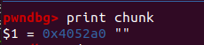
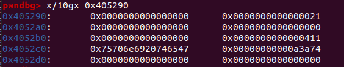
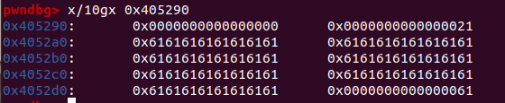
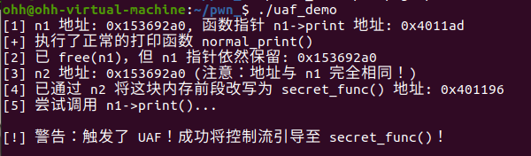
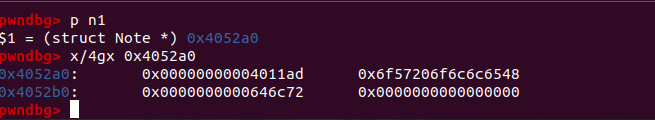
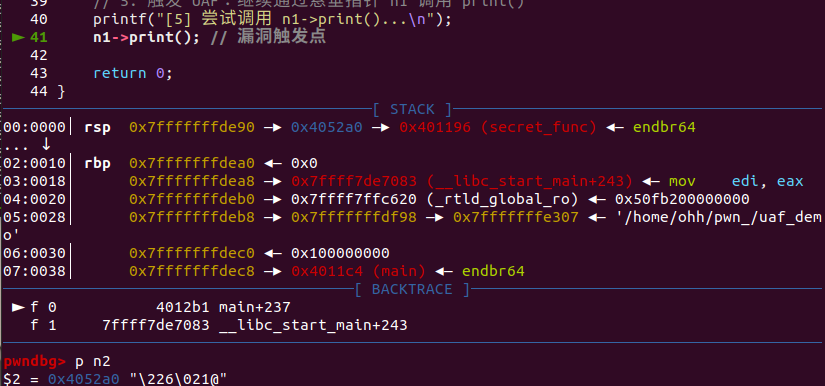
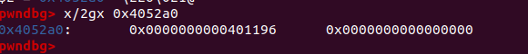
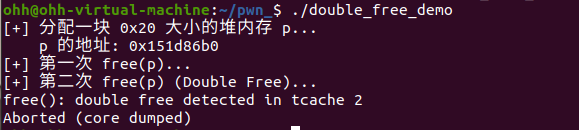
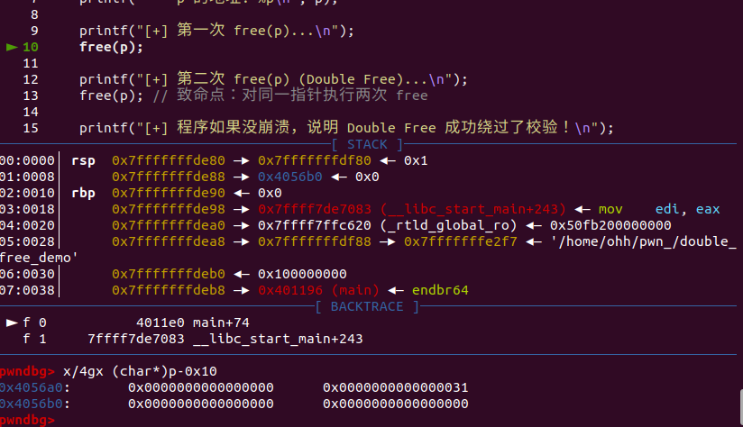
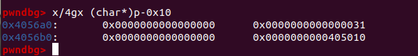

> 堆溢出(Heap Overflow)是指程序向某个堆块写入的字节数超过了其本身可使用的字节数，超出了边界，导致了数据溢出，并覆盖到物理相邻的高地址的下一个堆块
>
> 注意：这里说可使用的字节数而不是用户申请的字节数，是因为堆管理器会对用户申请的字节数进行调整，从而可利用的字节数都不小于本身申请的字节数。。。

## 原因

1.缓冲区溢出：程序向堆中分配的缓冲区写入过多数据导致溢出

2.内存管理器错误：程序错误释放内存或重复释放同一块内存

3.未初始化内存：使用未初始化的堆内存可能导致错误

4.整数溢出：计算内存大小时发生整数溢出，导致分配的内存过小

```C
char *buffer = (char *)malloc(10); // 分配 10 字节的堆内存
strcpy(buffer, "Today,I want to go shopping and eat hamburgers!"); // 写入超过10字节的数据，触发堆溢出
```

可以知道，发生堆溢出的前提就是要么程序往堆上写数据，要么写入的数据大小没控制好

## 后果

**覆盖相邻的内存**：溢出的数据可能会覆盖堆中的其他内存块，比如chunk头

我们直接来演示一下

### heap_overflow

```C 
#include <stdio.h>
int main(void) 
{
  char *chunk;
  chunk=malloc(24);
  puts("Get input:");
  gets(chunk);
  return 0;
}
```

这一段代码典型的gets危险函数，我们来看看溢出全过程

```python
gdb ./heap_overflow
```

调试一下，然后把断点下在第7,8行，随后r运行



看一下初始chunk的地址，注意，这里因为我们获取的指针是从堆块的数据区开始的，而堆块的头部（Header，包含大小信息）在这个地址的前16个字节处，所以我们需要减去16

算出来地址是0x405290，看一下布局



```python 
0x405290:   0x0000000000000000  0x0000000000000021  <-- chunk 头部 (size: 0x21)
0x4052a0:   0x0000000000000000  0x0000000000000000  <-- chunk 数据区
0x4052b0:   0x0000000000000000  0x0000000000000411  <-- Top chunk 头部
0x4052c0:   0x75706e6920746547	0x00000000000a3a74
```

继续下一步c，输入aaaaaaaaaa......，直接触发溢出



可以发现原本 top chunk上的数据全部被我们覆盖了

**破坏堆管理结构**：攻击者可以通过覆盖堆管理结构来控制内存分配和释放

**执行任意代码**：通过覆盖指针，返回地址等，控制程序执行流

---

## 利用过程

**1. 触发漏洞**

- **直接内存拷贝越界**：程序在堆上分配了内存后，使用不安全的函数（如 gets, strcpy, strcat, sprintf, memcpy 等）且未严格校验长度，导致写入的数据超出了堆块（Chunk）的实际容量。
- **整数溢出/符号错误**：在调用 malloc(size) 时，如果 size 的计算存在整数溢出（如a * b溢出变小）或符号转换错误，会导致分配的堆块过小，后续正常写入时引发堆溢出。
- **相关堆漏洞机制**：除了纯粹的溢出，UAF (Use-After-Free) 或Double Free同样可以用来破坏堆块内部的数据。

**2. 覆盖关键数据**
溢出的数据会覆盖相邻的高地址内存，主要攻击目标分为两类：

- 覆盖堆元数据：覆盖相邻空闲块（Free Chunk）的头部信息（如size字段、标志位）或链表指针（如 fd/bk）。或者覆盖Top Chunk的size字段（经典手法如 House of Force）。
- 覆盖堆内应用数据：如果相邻的堆块中存储了关键的业务结构体（如C++的对象虚表指针vptr、函数指针、认证标志位等），可以直接覆盖这些数据。

**3. 控制程序执行流（Control Execution Flow）**
这是堆利用的核心阶段，通常分为“直接劫持”和“间接劫持”：

- **直接劫持**：如果步骤 2 覆盖了堆中的函数指针或虚表指针，当程序后续调用该指针时，控制流直接被劫持。
- **间接劫持**：通过伪造 fd/bk 指针并触发 malloc/free，利用堆管理器的解链（Unlink）机制或缓存机制（如 Fastbin poisoning, Tcache poisoning），迫使堆管理器将**下一个堆块分配到攻击者指定的任意地址**（例如 __malloc_hook, __free_hook, GOT表, 或栈上的返回地址处）。然后向这个伪造的堆块写入数据，即将目标地址修改为恶意指令地址。

**4. 执行恶意代码**
一旦获得了控制执行流的能力（例如成功修改了GOT表中的puts函数指针，或覆写了栈上的返回地址），即可执行攻击载荷：

- **劫持到One-Gadget / System**：将控制流指向libc中的system函数（如system("/bin/sh")），或利用libc中的One-Gadget直接获取shell。
- **构造ROP链（Return-Oriented Programming）**：如果启用了数据执行保护（NX），且需要绕过沙箱（如Seccomp限制了execve），可以利用**栈迁移（Stack Pivoting）**技术将栈指针（RSP/ESP）劫持到堆上，在堆上布置 ROP 链，通过open->read->write (ORW) 系统调用链来读取敏感文件。

注意，由于堆溢出不存在返回地址等可以直接控制的东西，因此不能和栈溢出一样覆盖eip，然后一步步走，所以我们应该：

1. 覆盖与其物理相邻的下一个 chunk的内容。
   - prev_size
   - size，主要有三个比特位，以及该堆块真正的大小。
     - NON_MAIN_ARENA
     - IS_MAPPED
     - PREV_INUSE
     - the True chunk size
   - chunk content，从而改变程序固有的执行流。
2. 利用堆中的机制（如unlink等 ）来实现任意地址写入（Write-Anything-Anywhere）或控制堆块中的内容等效果，从而来控制程序的执行流。

## 技术

1. Unlink攻击
当释放一个内存块并触发与相邻空闲块合并时，堆分配器会执行unlink操作将其从双向链表中脱链。攻击者通过堆溢出篡改相邻空闲块的双向链表指针（fd 和 bk），在unlink执行指针卸载FD->bk=BK; BK->fd=FD）时触发任意内存写入。（但现代glibc已引入Safe Unlinking校验进行防护）。

2. Use-After-Free (UAF)
程序在释放（free）某个堆块后，未将指向该内存的指针置空（形成悬垂指针），且后续代码继续使用了该指针。攻击者可利用堆内存重用机制分配并控制这块内存，进而通过悬垂指针篡改应用层数据或劫持函数调用流。

3. Fastbin攻击
Fastbin是glibc中用于快速管理小内存块的单向LIFO链表。攻击者通过堆溢出或Double Free篡改链表中空闲chunk的单向指针（fd），指向伪造的内存结构。当程序后续重新申请内存时，分配器会顺着被篡改的指针将目标地址作为合法堆块返回。

4. House of Spirit
一种在非堆区域伪造chunk的技术。攻击者在可控区域（如栈或全局变量区）构造符合分配器校验规则的伪造堆头（Fake Chunk），并诱导程序对其执行free操作将其放入空闲链表。后续通过malloc便可将该目标内存区域分配出来并直接修改其内容。

5. House of Force
针对Top Chunk的利用手法。攻击者通过堆溢出将Top Chunk的size字段修改为极大值，使分配器认为堆空间无限。随后通过申请一次精心计算的大尺寸内存，将Top Chunk推进至任意目标地址，从而在下一次分配时直接掌控目标内存。

### unlink攻击

> 它主要针对的是glibc(GNU C Library)中内存分配器空闲内存块的机制

在glibc的内存管理中，当程序释放一块内存时，为了防止内存碎片化，分配器会检查相邻的内存块是否也是空闲的，如果是，他会将这些相邻空闲块也合并，当一个空闲块在双向链表中被取出，准备与其他块合并，或者被重新分配给用户，系统会调用一个叫做unlink的宏，将这个块从双向链表中摘除

对于unlink宏的底层伪代码如下（类似双向链表节点删除）

```C
#define unlink(P, BK, FD) { 
    FD = P->fd; 
    BK = P->bk; 
    FD->bk = BK; 
    BK->fd = FD; 
}
```

P：当前要被摘除的空闲内存块的指针

fd：指向链表的下一个空闲块的指针

bk：指向链表的上一个空闲块的指针

#### 攻击原理

核心：早期的unlink宏在执行指针操作时，没有检查指针的合法性

如果程序存在堆溢出漏洞，攻击者可以向相邻的空闲chunk写入数据，覆盖掉这个空闲块的fd和bk指针，比如：

- 令被覆盖的 P->fd = Target_Address - 0x18 （以64位系统为例，0x18是结构体偏移）
- 令被覆盖的 P->bk = Value_to_Write

执行完unlink之后

FD->bk=BK， 实际变成了*(Target_Address)=Value_to_Write

BK->fd=FD ， 实际变成了*(Target_to_Write+0x10)=Target_Address-0x18

结果就是成功将一个自定义的值写入到了一个任意的目标地址，这就实现了任意地址写的效果，可以通过这个覆盖GOT表，函数的返回地址或者关键变量

### Safe Unlinking

因为经典的unlink攻击威力太大，glibc在后续的版本(2.3之后)引入了防御机制--Safe Unlinking

加入了意向严格的完整性检验：

```C
if (__builtin_expect (FD->bk != P || BK->fd != P, 0))                      
  malloc_printerr (check_action, "corrupted double-linked list", P, AV);
```

意思就是在摘除节点之前，必须检查一下P的下一个节点的bk指针和P的上一个节点的fd指针是不是都指向P自己，因为按正常双向链表P->fd->bk=P且P->bk->fd=P，但是如果我们覆盖了指针，fd和bk被改成了伪造的地址，那里的内存大概率不会包含指向P的指针，因此会验证失败，终止运行

这时，绕过safe unlink就需要采用一些手段了，也就是得通过safe unlink的检查，覆盖的fd和bk不能再是任意地址，而是必须满足FD->bk==P和BK->fd==P，所以我们需要在程序的内存中找到一个指向当前  chunk P的已知指针（通常在.bss段的全局数组里），假设有一个全局指针Ptr指向当前的Chunk P，我们可以伪造：

- P->fd = &Ptr - 0x18 （64位环境下）
- P->bk = &Ptr - 0x10

当触发unlink时：

1. 检查阶段：
   - FD->bk 即 (&Ptr - 0x18) + 0x18 = Ptr，而 Ptr 里面存的值正好是指向 P 的地址，检查通过！
   - BK->fd 同理，检查通过！
2. 写入阶段：
   - 执行 FD->bk = BK 和 BK->fd = FD。
   - 最终的结果是：全局指针 Ptr 里面的值，变成了 &Ptr - 0x18。

结果：经过这样的操作，原本指向堆内存的全局指针Ptr，现在指向了它自己前面一点点的内存地址，我们便可以借此机会去更改内容


> 这里有个小关键点，就是关于0x18和0x10这两个数字，我们来探索一下
>
> 先来看看malloc_chunk结构体吧
>
> ```C
> struct malloc_chunk {
>   INTERNAL_SIZE_T      mchunk_prev_size;  // 偏移: 0x00 (前一个空闲块的大小)
>   INTERNAL_SIZE_T      mchunk_size;       // 偏移: 0x08 (当前块的大小)
>   struct malloc_chunk* fd;                // 偏移: 0x10 (指向下一个空闲块的指针)
>   struct malloc_chunk* bk;                // 偏移: 0x18 (指向上一个空闲块的指针)
>   // ... 后面还有其他字段，这里省略
> };
> ```
>
> fd指针在这个结构体里的相对位置是偏移0x10
>
> bk指针在这个结构体里的相对位置是偏移0x18
>
> 对于FD->bk==P这一条语句，高级语言C语言中，它会这么翻译：找FD块里的bk字段，而底层的汇编语言看来，没有字段名的概念，他只知道基地址+偏移量
>
> 所以翻译这句话：把FD当做基地址，然后往后移动0x18个字节，那里就是结果
>
> 所以FD->bk 等价于 *(FD+0x18)
>
> 同理，减去0x10是因为fd的偏移是0x10，只有减去之后才能完美抵消
>
> **让我们走一遍运行时的完美闭环（代入法）：**
>
> 1. 攻击者覆盖：P->fd = &Ptr - 0x18
> 2. Unlink 执行：FD = P->fd （此时 FD 变成了 &Ptr - 0x18）
> 3. Unlink 检查：FD->bk == P
> 4. 编译器翻译检查逻辑：*(FD + 0x18) == P
> 5. 代入我们的恶意数据：*(&Ptr - 0x18 + 0x18) == P
> 6. 神奇的事情发生了：- 0x18 和 + 0x18 **互相抵消了**！
> 7. 最终变成了：*(&Ptr) == P => 即检查 Ptr 里面存的值是不是 P。
> 8. 答案是：**YES！** 检查完美通过！

---

### UAF(Use-After-Free)

释放后重用。。

#### 概念

当一块堆内存被free释放掉后，指向这块内存的指针没有被置NULL（形成了所谓的悬垂指针），程序在后续的逻辑下，通过这个悬垂指针去读取或写入这块内存

下面我们就一个C语言程序来完整看看UAF的全过程

首先写一个存在UAF漏洞的程序

```C
#include <stdio.h>
#include <stdlib.h>
#include <string.h>

struct Note {
    void (*print)();   // 函数指针 (4/8字节)
    char content[24];  // 内容区域
};

void secret_func() {
    printf("\n[!] 警告：触发了 UAF！成功将控制流引导至 secret_func()！\n\n");
}

void normal_print() {
    printf("[+] 执行了正常的打印函数 normal_print()\n");
}

int main() {
    // 1. 分配第一个堆块 n1
    struct Note *n1 = (struct Note *)malloc(sizeof(struct Note));
    n1->print = normal_print;
    strcpy(n1->content, "Hello World");

    printf("[1] n1 地址: %p, 函数指针 n1->print 地址: %p\n", n1, n1->print);
    n1->print(); // 正常调用

    // 2. 释放 n1，但故意不将 n1 置为 NULL（形成悬垂指针）
    free(n1);
    printf("[2] 已 free(n1)，但 n1 指针依然保留: %p\n", n1);

    // 3. 申请相同大小的堆块 n2，系统会优先复用刚才释放的 n1 内存
    char *n2 = (char *)malloc(sizeof(struct Note));
    printf("[3] n2 地址: %p (注意：地址与 n1 完全相同！)\n", n2);

    // 4. 通过 n2 修改这块内存的前几个字节（覆写原来的函数指针）
    *(void **)n2 = (void *)secret_func;
    printf("[4] 已通过 n2 将这块内存前段改写为 secret_func() 地址: %p\n", secret_func);

    // 5. 触发 UAF：继续通过悬垂指针 n1 调用 print()
    printf("[5] 尝试调用 n1->print()...\n");
    n1->print(); // 漏洞触发点

    return 0;
}
```

编译为二进制文件

```python
gcc -g -no-pie uaf_demo.c -o uaf_demo
```



执行程序，在n1->print()这一步退出，触发了漏洞

用gdb调试，先下断点b 28，32，41



看一下n1的布局情况


可以看到第一列的0x4011ad就是normal_print的地址，继续执行两次c，让程序走完n2分配



发现这个时候n2的地址竟然和n1一样，其实也就是因为free n1之后，没有将n1置NULL，导致n2申请一样的内存直接把n1空出来的给他了



看一下内存分布，可以看到这个时候0x4052a0的第一个8字节的数据被覆盖成了0x401166


这个地址正好是secret_func的地址，执行下一步程序会直接执行这个函数

回顾一下全过程：

我们先正常向系统申请内存，然后赋给指针n1，然后把该地址处的前8个字节，写入了函数normal_print的内存地址，随后打印n1的地址和normal_print的地址，上文中的截图有呈现，调用n1->print()，正常调用，程序执行normal_print，随后，free(n1)，将该地址标记为空闲，收入Tcache/Fastbin链表中，但没有置空，也就是栈上的变量n1仍然存着旧地址，没有清空，随后申请一块大小一致的内存块，这是堆分配器会直接把刚才释放的直接再次分配给n2（Use After Free），他俩指向同一块内存，然后，我们把n2的值覆盖为secret_func的地址，因为n1，n2指向同一块内存，相当于把n1->print的函数指针换成了secret_func，由于该漏洞，再次执行n1->print()，这时，便会直接执行secret_func函数！

---

### double free

#### 定义

对同一个指针或同一块内存，在没有重新分配的情况下，连续调用了两次free

> 差不多意思就是我不知道这个变量已经free掉了，所以free他了两次，然后在malloc的时候，拿到了同一块内存

```C
void *p = malloc(0x20);
free(p); // 第一次 free
free(p); // 第二次 free (Double Free!)
```

堆管理器的fastbin单向链表（LIFO，后进先出）

第一次free： glibc把p放进fastbin链表，链表Head->p->NULL

第二次free：堆管理器以为p是一个新的空闲块，再次把p插入头部，Head->p->p->p....

后续调用malloc，第一次malloc，正常返回指针ptr1=p，链表Head->p

第二次malloc，返回指针ptr2=p，这两个指针完全指向同一块物理内存，只要通过ptr1写入数据，就会同步更改ptr2的数据，这就实现了堆块重叠

同样，我们来看一个例子深刻理解一下全过程

先写一个存在Double Free的程序

```C
#include <stdio.h>
#include <stdlib.h>

int main() {
    printf("[+] 分配一块 0x20 大小的堆内存 p...\n");
    void *p = malloc(0x20);
    printf("    p 的地址: %p\n", p);

    printf("[+] 第一次 free(p)...\n");
    free(p);

    printf("[+] 第二次 free(p) (Double Free)...\n");
    free(p); // 致命点：对同一指针执行两次 free

    printf("[+] 程序如果没崩溃，说明 Double Free 成功绕过了校验！\n");
    return 0;
}
```

编译一下

```C
gcc -g -no-pie double_free_demo.c -o double_free_demo
```

运行看一下



发现第二次free后退出了。。

GDB看看过程，在两次Free前断一下



继续执行



注意这里

```C 
(gdb) x/4gx (char*)p-0x10
0x4056a0:	0x0000000000000000	0x0000000000000031
0x4056b0:	0x0000000000000000	0x0000000000405010 <-- 现代 glibc 在这里写入了 key 标记！
```

在现代 glibc 中，当 p 被放进 Tcache 链表后，系统会在 p 的内部写入一个 key 标志（通常指向 tcache 结构体基地址）,检查到了这个key，并在Tcache里找到相同的p，非法释放，退出

> 目前的话，由于直接free两次会报错（加入了安全机制），所以对于double free我们通常使用两个指针，先free A，然后free B，这样我检查fastbin的头就不是A了，能正常释放，继续free A，这样也能形成A->B->A的闭环，然后任意地址读入，getshell

**总结一下**

| 漏洞类型        | 发生原因                                | GDB 观察到的现象                                             | 防御手段                                                     |
| --------------- | --------------------------------------- | ------------------------------------------------------------ | ------------------------------------------------------------ |
| **UAF**         | 释放内存后没有把指针置为 NULL           | 后续申请的新内存复用了旧地址；用旧指针访问到了新改写的数据/函数指针 | 释放后**立即置 NULL**：<br>free(p); p = NULL;                |
| **Double Free** | 同一指针没有清空，导致被调用两次 free() | 导致空闲链表结构破坏（旧版 glibc 会形成链表自环，新版 glibc 会直接报错崩溃） | 释放后**立即置 NULL**：<br>free(NULL) 在 C 语言中是安全且静默跳过的 |

### 关系

由这里可以很清楚地看出二者的关联--

> **Double Free 是一种特殊的、更极端的 UAF；而 UAF 则是 Double Free 能够被成功利用的关键土壤。**

UAF：释放后重用，一块内存被free释放后，指针没有被清空，程序后续依旧去读取或者修改这块内存

Double Free：重复释放，同一块内存被free了两次

Double Free往往是导致UAF的原因，而UAF是引起Double Free并完成利用的关键手段

步骤上的先后顺序：

1. 发生 UAF 的隐患
   程序申请了内存，用完后 free(ptr) 释放了，但没有把ptr=NULL，这时候就已经埋下了UAF的祸根（悬挂指针/Dangling Pointer）。
2. Double Free
   因为程序不知道这块内存已经被释放了（由于指针没清空），在某个错误的时机，程序又执行了一次 free(ptr)。这就触发了Double Free。
3. 利用UAF完成攻击
   正如我们刚才在实操中看到的，触发Double Free之后，内存管理器的链表乱了。此时我们要想修改链表里的指针（如改写fd指针），必须依赖UAF（即通过还活着的chunk去编辑那块已经被释放的内存）。

---

*以上内容如有理解不到位或表述不当的地方，还请各位师傅不吝赐教。*
